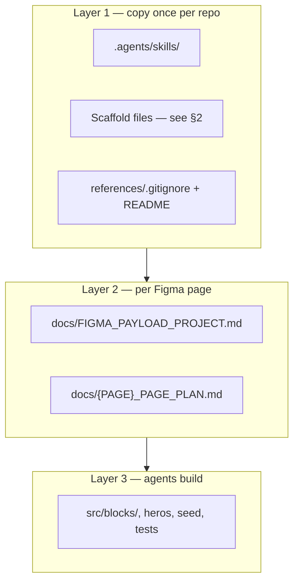

# Migrate this stack to another project

**Yes — you can reuse this workflow on any Next.js + Payload 3 + Figma project.**  
Home in `payload-figma-boilerplate` is a **reference implementation**, not something you copy wholesale.

Agents follow **skills + config docs**. Page code, block slugs, and Figma node IDs are always per project.

---

## Three layers



| Layer | What | Site-specific? |
|-------|------|------------------|
| **1. Skills + scaffold** | Process, Payload patterns, Playwright QA | **No** — same everywhere |
| **2. Project config** | fileKey, routes, token prefix, test IDs | **Per repo** (names differ) |
| **2. Page plan** | Section list, Figma node IDs, phases | **Per page** |
| **3. Implementation** | Components, blocks, seed data | **Per page** — use as example only |

---

## 1. Copy skills (mandatory)

From this repo (recommended — installs **all four** required skills, manifest, `AGENTS.md`, and `MIGRATE.md`):

```bash
# From payload-figma-boilerplate (this repo)
pnpm skills:install /path/to/new-project
pnpm skills:install /path/to/new-project --deps --config   # + npm devDeps + docs/FIGMA_PAYLOAD_PROJECT.md

# Verify in the target project
pnpm skills:verify /path/to/new-project
```

Manual copy (same result):

```bash
TARGET=/path/to/new-project

mkdir -p "$TARGET/.agents/skills"
cp -R .agents/skills/figma-payload-cms "$TARGET/.agents/skills/"
cp -R .agents/skills/payload            "$TARGET/.agents/skills/"
cp -R .agents/skills/playwright          "$TARGET/.agents/skills/"
cp -R .agents/skills/playwright-cli     "$TARGET/.agents/skills/"
cp    .agents/MIGRATE.md                "$TARGET/.agents/" 2>/dev/null || true
```

All four skills are **required** — the installer always copies the full set and writes `.agents/skills/manifest.json`.

Paste into target `AGENTS.md` — full snippet in [figma-payload-cms/STACK_SETUP.md](skills/figma-payload-cms/STACK_SETUP.md).

---

## 2. Copy scaffold (not in `.agents` yet — copy from reference repo)

These files are **stack plumbing**. They are generic; names inside can be renamed when you add your first page.

| Source (payload-figma-boilerplate) | Target | Purpose |
|----------------------|--------|---------|
| `scripts/seed-cli.mts` | `scripts/seed-cli.mts` | `pnpm seed` + `SEED_ADMIN_*` |
| `scripts/check-figma-refs.mts` | `scripts/check-figma-refs.mts` | `pnpm figma:refs:check` |
| `scripts/figma-refs-setup.md` | `scripts/figma-refs-setup.md` | Phase 0 export guide |
| `src/endpoints/seed/ensureAdminUser.ts` | same path | Seed admin from env |
| `src/endpoints/seed/fetchLocalFile.ts` | same path | Load `public/media/figma/` |
| `playwright.visual.config.ts` | root | Visual test config |
| `tests/global/visualGlobalSetup.ts` | same | Seed once before visual workers |
| `tests/helpers/visualSectionSnapshot.ts` | same | Batch snapshot helpers |
| `tests/helpers/visualPageReady.ts` | same | Re-export shim |
| `tests/helpers/seedUser.ts` | same | Uses `ensureAdminUser` |
| `tests/seed.spec.ts` | same | Playwright CLI attach entry |
| `tests/visual/full-page.visual.spec.ts` | same | Adapt `@full-page` tag |
| `tests/visual/sections/all-sections.visual.spec.ts` | same | Adapt section list import |
| `references/playwright/.gitignore` | same | Never commit baselines |
| `references/figma/.gitignore` | same | Never commit gold masters |
| `references/playwright/README.md` | same | Baseline docs |
| `.env.example` | merge | Add `SEED_ADMIN_*` |

**Merge into target `package.json` scripts:**

```json
"seed": "cross-env NODE_OPTIONS=--no-deprecation tsx scripts/seed-cli.mts",
"seed:fresh": "rm -f YOUR.db && pnpm seed",
"figma:refs:check": "cross-env NODE_OPTIONS=--no-deprecation tsx scripts/check-figma-refs.mts",
"cli": "playwright-cli",
"test:debug": "cross-env NODE_OPTIONS=\"--no-deprecation --import=tsx/esm\" playwright test --debug=cli",
"test:visual": "cross-env NODE_OPTIONS=\"--no-deprecation --import=tsx/esm\" playwright test --config=playwright.visual.config.ts --grep-invert @isolated",
"test:visual:sections": "... --grep \"@sections batch\"",
"test:visual:full-page": "... --grep \"@full-page\"",
"test:visual:section": "... --grep \"@section @isolated\"",
"test:visual:live": "... playwright test tests/seed.spec.ts --debug=cli"
```

**Merge into target `.gitignore`:**

```gitignore
public/media/*
!public/media/figma/
!public/media/figma/**
references/playwright/**/*
!references/playwright/**/
!references/playwright/.gitignore
!references/playwright/**/*.md
references/figma/**/*
!references/figma/**/
!references/figma/.gitignore
!references/figma/**/.gitkeep
!references/figma/**/*.md
/test-results/
/playwright-report/
```

Use [STACK_SETUP.md](skills/figma-payload-cms/STACK_SETUP.md) as the checklist after copying.

---

## 3. Per-project setup (first page)

1. Copy [project-config.template.md](skills/figma-payload-cms/project-config.template.md) → `docs/FIGMA_PAYLOAD_PROJECT.md`  
   Replace `{placeholders}` — **do not** copy component names unless your brand is Site.

2. Copy [plan-template.md](skills/figma-payload-cms/plan-template.md) → `docs/{YOUR_PAGE}_PAGE_PLAN.md`  
   Fill Figma node IDs, section table, build/QA subagent rows.

3. Phase 0 (one agent run):
   - Figma MCP `get_metadata` + `download_assets` → `public/media/figma/`
   - Optional gold masters → `references/figma/{page}/` (local only)
   - `pnpm figma:refs:check`

4. Run workflow from [SKILL.md](skills/figma-payload-cms/SKILL.md) — phases 1–8 with subagents.

**Reference only (do not copy as-is):**

- [examples/example-implementation.md](skills/figma-payload-cms/examples/example-implementation.md)
- `docs/EXAMPLE_PAGE_PLAN.md`
- `src/blocks/*`, `src/heros/MarketingHero/`, `src/endpoints/seed/home.ts`

---

## What `.agents` gives you (speed)

| Without skills | With this pack |
|----------------|----------------|
| Reinvent Payload block/seed patterns | [payload-patterns.md](skills/figma-payload-cms/payload-patterns.md) + Payload skill |
| Ad-hoc Figma → code | Phased gates, spacing audit, editor UX rules |
| One agent builds + QA same section | [subagent-strategy.md](skills/figma-payload-cms/subagent-strategy.md) — parallel build/QA |
| Slow visual test loops | Batch specs + Playwright CLI live QA |
| Snapshots in git | Git policy + `.gitignore` patterns |

Typical savings: **process and QA are reusable**; implementation time still scales with number of Figma sections.

---

## Minimum viable new project

```
new-project/
├── .agents/
│   ├── MIGRATE.md
│   └── skills/
│       ├── figma-payload-cms/   ← workflow
│       ├── payload/             ← CMS API
│       ├── playwright/          ← E2E/visual index
│       └── playwright-cli/      ← live QA
├── AGENTS.md
├── docs/
│   ├── FIGMA_PAYLOAD_PROJECT.md
│   └── CONTACT_PAGE_PLAN.md     ← example second page
├── scripts/seed-cli.mts
├── playwright.visual.config.ts
├── tests/global/, tests/helpers/, tests/visual/, tests/seed.spec.ts
├── references/playwright/, references/figma/   ← structure + gitignore only
└── public/media/figma/          ← seed assets only (committed)
```

---

## Sharing across repos (pick one)

| Method | Best for |
|--------|----------|
| **Copy** `.agents/skills/` into each repo | Teams, simple git |
| **Submodule** skill pack repo | Central updates |
| **`~/.cursor/skills/`** for figma-payload-cms | Personal projects only — still need `docs/FIGMA_PAYLOAD_PROJECT.md` per repo |

---

## Verify migration

```bash
# In target repo
pnpm add -D @playwright/test @playwright/cli tsx cross-env dotenv
pnpm exec playwright install chromium
pnpm seed:fresh
pnpm test:e2e
pnpm test:visual        # after first page is built + baselines generated locally
```

Questions agents should answer from docs alone: Figma fileKey, test ID pattern, seed command, which skill to load.  
If those are in `FIGMA_PAYLOAD_PROJECT.md`, migration worked.
