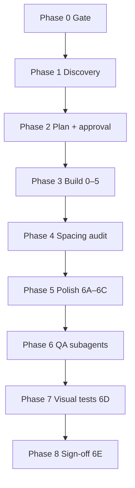

# Figma + Cursor + Payload CMS

Portable workflow (same in every repo):

**Figma → plan doc → build subagents (0–5) → spacing audit → polish (6) → QA subagents → visual regression → sign-off**

## Before any work in a repo

1. Read **`docs/FIGMA_PAYLOAD_PROJECT.md`** (from [project-config.template.md](project-config.template.md) if missing)
2. Read the page plan **`docs/{PAGE}_PAGE_PLAN.md`**
3. Load Payload skill if present: `.agents/skills/payload/SKILL.md`
4. Optional adapter: [adapters/payload-website-template.md](adapters/payload-website-template.md)

**Install / share:** [README.md](README.md)

## Prerequisites

| Tool | Purpose |
|------|---------|
| Figma MCP | `get_metadata`, `get_design_context`, `get_variable_defs`, `get_screenshot`, `download_assets` |
| Payload CMS + frontend | Blocks, globals, hero — paths in project config |
| Cursor subagents | Parallel build + parallel QA |
| Playwright | E2E + visual regression (optional but recommended for Phase 6) |

## Process overview



**Rule:** **Separate subagents for build vs QA.** Builders implement; QA agents read code + Figma → PASS/FAIL + ranked fixes. Parent applies fixes and re-runs tests.

---

## Phase 0 — Gate

Do not code until:

1. Figma MCP reads the file (`get_metadata` succeeds)
2. User approved `docs/{PAGE}_PAGE_PLAN.md`
3. `docs/FIGMA_PAYLOAD_PROJECT.md` exists with component names and test IDs
4. Scope answered (brand, CMS vs hardcoded, seed strategy)

Figma MCP sequence: see [figma-access.md](figma-access.md).

---

## Phase 1 — Discovery (parallel subagents)

**Subagent A — Figma:** Sections top→bottom, copy, tokens, breakpoints, **spacing from `get_design_context`**.

**Subagent B — Codebase:** Map to Payload entities using paths from **project config**. Report extend vs net-new blocks.

Generic mapping:

| Figma | Payload |
|-------|---------|
| Nav | header global |
| Hero | hero variant (usually not a block) |
| Sections | layout blocks |
| Footer | footer global |

---

## Phase 2 — Plan document

Use [plan-template.md](plan-template.md). Store Figma node IDs, field schemas, phases, spacing notes, acceptance criteria, approval gate.

---

## Phase 3 — Build (Phases 0–5, build subagents)

| Phase | Scope |
|-------|--------|
| 0 | Design tokens, field factories, **shared components from project config** |
| 1A | Header / footer |
| 1B | Hero variant |
| 2 | Blocks (`config` + `Component`) — parallel |
| 3 | Register blocks, generate types |
| 4 | Seed + assets |
| 5 | E2E smoke tests |

Use **project config** component names (not hardcoded `Glance*` names).

### Build subagent prompt (template)

```
Project: {repo path}
Config: docs/FIGMA_PAYLOAD_PROJECT.md
Plan: docs/{PAGE}_PAGE_PLAN.md — Phase {N}
Skills: .agents/skills/figma-payload-cms/spacing-patterns.md + payload skill if any
Figma: fileKey {key}, node {id}
Use SectionContainer (or name from config) for horizontal inset.
Do NOT use symmetric py-* when inner border-t pt-* exists.
Do NOT commit unless asked.
```

---

## Phase 4 — Spacing audit (readonly subagents)

After functional build, audit **all** section `Component.tsx` files vs Figma `get_design_context`.

Split scope: shell | blocks batch A | blocks batch B | cross-cutting (RenderBlocks, globals).

Document in plan §5B. Patterns: [spacing-patterns.md](spacing-patterns.md).

---

## Phase 5 — Visual polish (6A–6C, build subagents)

| Sub-phase | Scope |
|-----------|--------|
| 6A | Shared components + test helpers (sequential first) |
| 6B | Header, hero, footer (parallel) |
| 6C | Blocks in groups of 2–4 (parallel) |

Apply spacing patterns from Figma MCP values, not guesses.

---

## Phase 6 — QA (readonly subagents)

Never the same agent that built. Check spacing, testids, a11y, visual infra. Return PASS/FAIL + severity.

---

## Phase 7 — Visual regression (6D)

[visual-qa.md](visual-qa.md) — **full-page + per-section** snapshots at breakpoints from project config.

---

## Phase 8 — Sign-off (6E)

Compare `full-page.png` to Figma desktop frame node. Update plan acceptance criteria. Note exceptions in `references/figma/.../MANIFEST.md`.

---

## Troubleshooting

| Symptom | Fix |
|---------|-----|
| Gaps too large | [spacing-patterns.md](spacing-patterns.md) — doubled outer `py-*` |
| Section OK alone, wrong on page | `full-page.png` — boundary padding stacks |
| Visual tests flake | `workers: 1`, serial mode, wait fonts + images |
| Wrong component names in skill output | Agent skipped `FIGMA_PAYLOAD_PROJECT.md` |
| Figma access denied | [figma-access.md](figma-access.md) |

---

## Reference docs

| Doc | Contents |
|-----|----------|
| [README.md](README.md) | Install / share across projects |
| [project-config.template.md](project-config.template.md) | Per-repo config |
| [spacing-patterns.md](spacing-patterns.md) | Vertical rhythm |
| [visual-qa.md](visual-qa.md) | Playwright snapshots |
| [payload-patterns.md](payload-patterns.md) | Payload CMS conventions |
| [figma-access.md](figma-access.md) | MCP tools |
| [plan-template.md](plan-template.md) | Page plan |
| [examples/](examples/) | Real project references |
