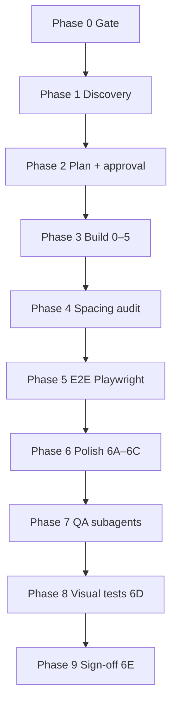

# Figma + Cursor + Payload CMS

Portable workflow (same in every repo):

**Figma → plan doc → build subagents (one per section) → QA subagents → E2E (Playwright) → polish → visual regression (Playwright) → sign-off**

Subagent rules: [subagent-strategy.md](subagent-strategy.md) · Playwright: [playwright-qa.md](playwright-qa.md)

## Before any work in a repo

1. Read **`docs/FIGMA_PAYLOAD_PROJECT.md`** (from [project-config.template.md](project-config.template.md) if missing)
2. Read the page plan **`docs/{PAGE}_PAGE_PLAN.md`**
3. Load **Payload** skill: `.agents/skills/payload/SKILL.md` — **required**
4. Load **Playwright** skill: `.agents/skills/playwright/SKILL.md` — routes to [playwright-qa.md](playwright-qa.md) and [visual-qa.md](visual-qa.md)
5. Load **Playwright CLI** skill: `.agents/skills/playwright-cli/SKILL.md` — **required** for live section QA
6. Optional adapter: [adapters/payload-website-template.md](adapters/payload-website-template.md)

New repo? Follow [STACK_SETUP.md](STACK_SETUP.md) first.

**Install / share:** [README.md](README.md)

## Prerequisites

| Tool | Purpose |
|------|---------|
| Figma MCP | `get_metadata`, `get_design_context`, `get_variable_defs`, `get_screenshot`, `download_assets` |
| Payload CMS + frontend | Blocks, globals, hero — paths in project config |
| **Payload skill** | `.agents/skills/payload/SKILL.md` — schema, hooks, access, queries |
| Cursor subagents | **One build + one QA subagent per section** (never the same agent) — [subagent-strategy.md](subagent-strategy.md) |
| Playwright (`@playwright/test`) | E2E smoke (Phase 5) + visual regression (Phase 6D) — [playwright-qa.md](playwright-qa.md) |
| **Playwright CLI** (`@playwright/cli`) | **Required** — live section QA, attach, snapshot — [playwright-qa.md](playwright-qa.md) |
| **Playwright CLI skill** | `.agents/skills/playwright-cli/SKILL.md` |
| Playwright skill | `.agents/skills/playwright/SKILL.md` — in-repo index; see playwright-qa.md |

**Git policy:** Commit Figma seed assets (`public/media/figma/`). Never commit snapshot PNGs under `references/` or Playwright report artifacts. See [STACK_SETUP.md](STACK_SETUP.md).

## Process overview



**Rule:** **Separate subagents for build vs QA — one section per subagent.** Builders implement; QA agents (readonly) compare code + Figma → PASS/FAIL + ranked fixes. The agent that built a section must never QA that same section. Parent applies fixes and re-runs QA. Full pattern: [subagent-strategy.md](subagent-strategy.md).

---

## Phase 0 — Gate

Do not code until:

1. Figma MCP reads the file (`get_metadata` succeeds)
2. User approved `docs/{PAGE}_PAGE_PLAN.md`
3. `docs/FIGMA_PAYLOAD_PROJECT.md` exists with component names and test IDs
4. Scope answered (brand, CMS vs hardcoded, seed strategy)
5. **Editor experience** defined — block labels, field glossary, semantic styling, link strategy ([editor-experience.md](editor-experience.md))
6. **Section anchors** mapped — block slug → HTML id for nav ([section-anchors.md](section-anchors.md))
7. **Figma reference cache** (recommended) — one-time export of gold-master PNGs + seed assets to local disk; agents read `references/figma/` instead of re-calling MCP screenshots every run ([scripts/figma-refs-setup.md](../../scripts/figma-refs-setup.md), verify with `pnpm figma:refs:check`)
8. **Seed admin env** — set `SEED_ADMIN_EMAIL` / `SEED_ADMIN_PASSWORD` in `.env` so `pnpm seed:fresh` never requires manual first-user registration

Figma MCP sequence: see [figma-access.md](figma-access.md).

---

## Phase 1 — Discovery (parallel subagents)

**Subagent A — Figma:** Sections top→bottom, copy, tokens, breakpoints, **spacing from `get_design_context`**.

**Subagent B — Codebase:** Map to Payload entities using paths from **project config**. Report extend vs net-new blocks.

Generic mapping:

| Figma | Payload |
|-------|---------|
| Nav | header global |
| Hero | hero variant (usually not a block) |
| Sections | layout blocks |
| Footer | footer global |

---

## Phase 2 — Plan document

Use [plan-template.md](plan-template.md). Store Figma node IDs, field schemas, phases, spacing notes, acceptance criteria, approval gate.

---

## Phase 3 — Build (Phases 0–5, build subagents)

| Phase | Scope |
|-------|--------|
| 0 | Design tokens, field factories, **shared components from project config**, **editor labels** ([editor-experience.md](editor-experience.md)), **`sectionAnchors.ts`** ([section-anchors.md](section-anchors.md)) |
| 1A | Header / footer |
| 1B | Hero variant |
| 2 | Blocks (`config` + `Component`) — **one build subagent per block**, parallel |
| 3 | Register blocks, generate types |
| 4 | Seed + assets |
| 5 | E2E smoke tests — **Build-Tests** then **QA-Tests** subagents ([playwright-qa.md](playwright-qa.md)) |
| 5b | **QA wave** — one readonly QA subagent per section built in Phase 2 |

Use **project config** component names (not hardcoded `Site*` names).

### Build subagent prompt (template)

See full prompts in [subagent-strategy.md](subagent-strategy.md).

```
Role: BUILD only — do not QA this section.
Project: {repo path}
Config: docs/FIGMA_PAYLOAD_PROJECT.md
Plan: docs/{PAGE}_PAGE_PLAN.md — Phase {N} — Section: {name}
Figma: fileKey {key}, node {id}
Skills: spacing-patterns.md + section-anchors.md + subagent-strategy.md + playwright-qa.md + payload skill if any
Use SectionContainer (or name from config) for horizontal inset.
Do NOT use symmetric py-* when inner border-t pt-* exists.
Do NOT commit unless asked.
```

---

## Phase 4 — Spacing audit (readonly QA subagents)

After functional build, run **one readonly QA subagent per section** vs Figma `get_design_context` — not one monolithic audit.

Each QA agent owns: header | hero | footer | block-{name} | full-page boundaries (last).

Document findings in plan §5B. Patterns: [spacing-patterns.md](spacing-patterns.md). Prompts: [subagent-strategy.md](subagent-strategy.md).

---

## Phase 5 — Visual polish (6A–6C, build subagents)

| Sub-phase | Build subagents | QA subagents (after each wave) |
|-----------|-----------------|--------------------------------|
| 6A | 1 shared foundations | 1 readonly cross-cutting QA |
| 6B | 1 per shell piece (header, hero, footer) — parallel | 1 readonly QA per shell piece |
| 6C | **1 per block section** — parallel | **1 readonly QA per block** |

Apply spacing from Figma MCP values, not guesses. Never skip the QA wave — see [subagent-strategy.md](subagent-strategy.md).

---

## Phase 6 — QA (readonly subagents)

**One QA subagent per section** — never the agent that built it. Check spacing, typography, layout, testids, a11y, anchors. Return PASS/FAIL + severity-ranked fixes.

After all section QAs PASS, run **full-page QA subagent** for section-to-section proportions (see subagent-strategy.md).

---

## Phase 7 — Visual regression (6D)

[visual-qa.md](visual-qa.md) + [playwright-qa.md](playwright-qa.md) — **full-page + per-section** snapshots at breakpoints. **Build-VisualTests** / **QA-Visual** subagents separated. Use Playwright CLI to diagnose failing snapshots when installed.

---

## Phase 8 — Sign-off (6E)

Compare `full-page.png` to Figma desktop frame node. **Per-section QA subagents** must PASS before sign-off. Update plan acceptance criteria. Note exceptions in `references/figma/.../MANIFEST.md`.

---

## Troubleshooting

| Symptom | Fix |
|---------|-----|
| Gaps too large | [spacing-patterns.md](spacing-patterns.md) — doubled outer `py-*` |
| Section OK alone, wrong on page | `full-page.png` — boundary padding stacks |
| Visual tests flake / slow | Batch spec (`all-sections.visual.spec.ts`) — one navigation per viewport; use `pnpm test:visual:live` + CLI for agent QA — [visual-qa.md](visual-qa.md) |
| Visual baselines in git | PNGs under `references/playwright/` and `references/figma/` are **gitignored** — regenerate locally |
| E2E / snapshot failure | Playwright skill: `--trace on`, `test:debug` + `pnpm cli attach` |
| Wrong component names in skill output | Agent skipped `FIGMA_PAYLOAD_PROJECT.md` |
| Figma access denied | [figma-access.md](figma-access.md) |

---

## Reference docs

| Doc | Contents |
|-----|----------|
| [README.md](README.md) | Install / share across projects |
| [project-config.template.md](project-config.template.md) | Per-repo config |
| [spacing-patterns.md](spacing-patterns.md) | Vertical rhythm |
| [playwright-qa.md](playwright-qa.md) | Playwright E2E, visual tests, Playwright CLI, test subagents |
| [visual-qa.md](visual-qa.md) | Snapshot layout and baselines |
| [editor-experience.md](editor-experience.md) | Content author UX, labels, links, colors |
| [section-anchors.md](section-anchors.md) | Hardcoded in-page nav ids (not CMS) |
| [payload-patterns.md](payload-patterns.md) | Payload CMS conventions |
| [subagent-strategy.md](subagent-strategy.md) | Per-section build vs QA subagents (pixel-perfect) |
| [plan-template.md](plan-template.md) | Page plan |
| [examples/](examples/) | Real project references |
