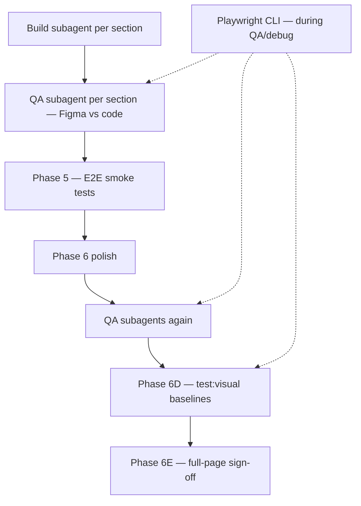

# Playwright + Playwright CLI (development & QA)

Playwright is part of the Figma → Payload workflow for **functional E2E**, **visual regression**, and **interactive section verification** during build/QA. Use it alongside Figma MCP and per-section subagents ([subagent-strategy.md](subagent-strategy.md)).

---

## Skills to load (agents)

| Skill | Location | When |
|-------|----------|------|
| **Playwright** | `~/.cursor/skills/playwright/SKILL.md` (or `.cursor/skills/playwright/`) | Writing, debugging, or reviewing any test; flakiness; locators |
| **Figma → Payload** | This skill pack | Page build, visual baselines, project config |
| **Playwright CLI skills** (optional) | After `playwright-cli install --skills` → under `node_modules` | Agent-driven browser exploration, `--debug=cli` sessions |

Load **Playwright** skill whenever touching `tests/e2e/`, `tests/visual/`, or investigating a failing snapshot.

---

## Tooling stack (per project)

| Package | Purpose | Typical scripts |
|---------|---------|-----------------|
| `@playwright/test` | E2E + visual regression (CI) | `test:e2e`, `test:visual` |
| `@playwright/cli` (optional, recommended) | Agent attach, snapshot, heal, explore | `cli`, `test:debug` |

Document commands in **`docs/FIGMA_PAYLOAD_PROJECT.md`**.

### Optional: add Playwright CLI to a Payload / Next.js repo

```bash
pnpm add -D @playwright/cli
pnpm exec playwright-cli install --skills   # refresh agent skills for CLI workflows
```

Add to `package.json` (adjust if your repo already wraps CLI):

```json
{
  "scripts": {
    "cli": "playwright-cli",
    "test:debug": "playwright test --debug=cli"
  }
}
```

Use **`pnpm cli`** (or `pnpm exec playwright-cli`) — not a global install.

---

## Where Playwright fits in the workflow



| Phase | Playwright role | Subagents |
|-------|-----------------|-----------|
| **5** | E2E smoke — page loads, blocks visible, anchors, key links | **Build-Tests** writes/updates specs; **QA-Tests** readonly review |
| **6D** | Visual regression — full-page + per-`data-testid` snapshots | **Build-VisualTests** infra/baselines; **QA-Visual** compare failures vs Figma |
| **During 6B/6C QA** | CLI explore one section in browser while Figma MCP compares | QA subagent may use `pnpm cli snapshot` on `{route}#{anchor}` |
| **After failure** | Trace / UI mode / `--debug=cli` — never the same agent that wrote the failing test without review | **QA-Tests** diagnoses; **Build-Tests** fixes |

---

## Commands (Payload Website Template style)

From project config — typical values:

```bash
# Functional E2E (Phase 5)
pnpm test:e2e
pnpm test:e2e --grep "Glance Home"

# Visual regression (Phase 6D) — see visual-qa.md
pnpm test:visual
pnpm test:visual --grep "full-page"
pnpm test:visual --update-snapshots   # only after intentional layout change + QA PASS

# Interactive debug (load Playwright skill)
npx playwright test --ui
npx playwright test tests/e2e/glance-home.e2e.spec.ts --trace on

# Playwright CLI (when @playwright/cli installed)
pnpm test:debug tests/e2e/glance-home.e2e.spec.ts -g "anchor"
# → note tw-XXXX from output, then:
pnpm cli attach tw-XXXX
pnpm cli snapshot
pnpm cli generate-locator e5 --raw
pnpm cli resume
```

**Before visual tests:** seed CMS (`pnpm seed` / `seed:fresh`), `workers: 1`, serial mode — see [visual-qa.md](visual-qa.md).

---

## Locator strategy (this workflow)

Align with Playwright skill — accessibility-first, project `data-testid` for sections:

| Target | Locator |
|--------|---------|
| Header / hero / footer | `[data-testid="…"]` from project config |
| Each block | `[data-testid="block-{slug}"]` |
| In-page nav | `page.locator('#benefits')` or hash from [section-anchors.md](section-anchors.md) |
| CMS admin smoke | `getByRole`, `getByLabel` |

Use **`getByRole` / `getByLabel`** for admin and forms; **`data-testid`** for marketing sections tied to visual snapshots.

---

## Subagent: Build-Tests (Phase 5)

```
Role: BUILD tests only — do not QA your own specs.

Project: {repo}
Config: docs/FIGMA_PAYLOAD_PROJECT.md
Skills: playwright/SKILL.md + visual-qa.md + section-anchors.md

Tasks:
1. Ensure seed helper runs in test beforeAll (shared with visual tests)
2. E2E: page load, all block testids visible, section anchor ids, critical links
3. Use visualPageReady helper — wait fonts + images (no waitForTimeout)
4. Align with existing playwright.config.ts / playwright.visual.config.ts

Do NOT commit unless asked.
```

---

## Subagent: QA-Tests (readonly, after Build-Tests)

```
Role: QA tests only — readonly. You did NOT write these specs.

Skills: playwright/SKILL.md

Tasks:
1. Review spec files for: strict-mode locators, no sleep, seed before destructive DB tests
2. Run pnpm test:e2e (and test:visual if Phase 6D) — report PASS/FAIL
3. On FAIL: trace path, failing line, root cause (test vs app vs env)
4. Recommend fixes — assign Build-Tests subagent, not self

Do NOT edit files unless parent asks you to fix tests only.
```

---

## Subagent: QA-Visual (Phase 6D / 6E)

After per-section code QA PASS:

```
Role: Visual QA — compare Playwright output to Figma.

Skills: visual-qa.md + playwright/SKILL.md

Tasks:
1. Run pnpm test:visual — capture failing snapshot names
2. Map failure to section testid → Figma node from page plan
3. get_screenshot(nodeId) vs references/playwright/... — describe diff (spacing, type, color)
4. Verdict per section: PASS | FAIL + whether to fix code or update baseline

Full-page failures: check section boundary padding before per-block tweaks.
```

Use **Playwright CLI** to open the page at the failing viewport, scroll to the section, and `snapshot` for accessibility-tree context when diagnosing.

---

## Playwright CLI during section QA (optional)

When a **readonly QA subagent** fails a section on spacing/layout:

1. `pnpm dev` running (or webServer in config)
2. `pnpm cli open http://localhost:3000#{anchor}` — or attach via `test:debug`
3. `pnpm cli snapshot` — compare structure to Figma copy
4. Report findings to parent; **Build-{Section}** subagent fixes component

Do not use CLI to replace Figma MCP for design tokens — use both: Figma for values, CLI for live DOM state.

---

## Plan doc requirements

In `docs/{PAGE}_PAGE_PLAN.md`:

| Item | Section |
|------|---------|
| E2E spec paths | §5 Phase 5 |
| Visual spec + baseline folder | §5C Phase 6D |
| `data-testid` list | §3 / project config |
| Playwright commands | project config Commands table |
| Build-Tests / QA-Tests subagent rows | §5 subagent table |

---

## Checklist

- [ ] `@playwright/test` configured with `webServer: pnpm dev`
- [ ] Seed helper shared by E2E + visual tests
- [ ] Section testids match [visual-qa.md](visual-qa.md)
- [ ] E2E asserts section anchor ids from [section-anchors.md](section-anchors.md)
- [ ] `(optional) @playwright/cli` + `pnpm cli install --skills`
- [ ] Build-Tests and QA-Tests subagents separated
- [ ] Visual baselines only updated after section QA PASS

---

## Anti-patterns

| Avoid | Do instead |
|-------|------------|
| One agent writes and “verifies” tests alone | Build-Tests + QA-Tests subagents |
| `waitForTimeout` in visual specs | `visualPageReady` + expect auto-wait |
| Update snapshots without QA | Section QA PASS → then `--update-snapshots` |
| Skip E2E before visual | Phase 5 green → then Phase 6D |
| Global `npx playwright-cli` | Project devDependency + `pnpm cli` |
