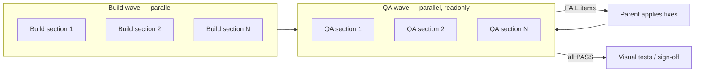

# Subagent strategy (build vs QA)

**Goal:** pixel-perfect fidelity by never letting the same agent both implement and judge a section.

Use **one subagent per section** for build and **a separate subagent per section** for QA — launched in parallel where possible. The parent agent orchestrates, applies fixes, and re-runs QA until PASS.

Applies to: initial block build (Phase 2), spacing audit (Phase 4), visual polish (Phase 6), and pre–visual-test QA (Phase 6E).

---

## Core rules

| Rule | Why |
|------|-----|
| **Build ≠ QA** | The agent that wrote the code optimizes for “done”; a fresh agent compares to Figma without bias |
| **One section per subagent** | Narrow context → accurate spacing, typography, and layout vs `get_design_context` for that node |
| **QA is readonly** | QA subagents report PASS/FAIL + ranked fixes; they do not edit files |
| **Parent applies fixes** | Orchestrator merges QA output, assigns fix subagents (or self), re-runs QA for failed sections |
| **Parallel by default** | Independent sections (blocks, header, hero, footer) run concurrently |

**Never:** one subagent builds header + 8 blocks + QA in the same turn.  
**Never:** the build subagent for section X runs QA for section X.

---

## Section list (define in page plan)

From Figma top → bottom, assign each **unit** its own build + QA pair:

| # | Section | Payload entity | Figma node ID | Build subagent | QA subagent |
|---|---------|----------------|---------------|----------------|-------------|
| — | Nav | header global | `{id}` | Build-Header | QA-Header |
| 1 | Hero | hero variant | `{id}` | Build-Hero | QA-Hero |
| 2 | `{section}` | `{block slug}` | `{id}` | Build-{Name} | QA-{Name} |
| … | … | … | … | … | … |
| — | Footer | footer global | `{id}` | Build-Footer | QA-Footer |

Copy this table into `docs/{PAGE}_PAGE_PLAN.md` §5 (build phases) and §5C (Phase 6).

Shared foundations (Phase 0 / 6A) are the exception: **one** build subagent for tokens + SectionContainer + field factories, then **one** readonly QA subagent for cross-cutting patterns only.

---

## Workflow



| Phase | Build subagents | QA subagents |
|-------|-----------------|--------------|
| 5 E2E | Build-Tests | QA-Tests (readonly) |
| 6D Visual | Build-VisualTests | QA-Visual (readonly) |

Details: [playwright-qa.md](playwright-qa.md).

---

## When to run paired waves

| Phase | Build subagents | QA subagents |
|-------|-----------------|--------------|
| 2 — Blocks | One per new/updated block | After all blocks land — one QA per block |
| 4 — Spacing audit | *(none — audit only)* | One readonly QA per section vs Figma spacing |
| 5 — E2E | Build-Tests | QA-Tests (run specs, trace failures) |
| 6B — Shell polish | Header, hero, footer (parallel) | Separate QA each after 6B |
| 6C — Block polish | One per block group or per block | Separate QA per section after 6C |
| 6D — Visual | Build-VisualTests (spec + baselines) | QA-Visual (Figma vs snapshot diff) |
| 6E — Sign-off | *(none)* | One QA per section + full-page proportions |

Playwright-specific subagents: [playwright-qa.md](playwright-qa.md).

---

## Build subagent prompt (per section)

```
Role: BUILD only — do not QA your own work.

Project: {repo path}
Config: docs/FIGMA_PAYLOAD_PROJECT.md
Plan: docs/{PAGE}_PAGE_PLAN.md
Section: {section name} — Payload {entity} — Figma node {nodeId}
Skills: spacing-patterns.md, section-anchors.md, editor-experience.md, payload skill if any

Tasks:
1. get_design_context + get_screenshot for node {nodeId}
2. Implement/update {Component path} + {config path if block}
3. Use SectionContainer from project config; no doubled py-* + border-t pt-*
4. Editor-friendly labels only — no hex colors, no CMS anchor fields

Deliverables: working component, testid from project config.
Do NOT commit unless asked.
```

---

## QA subagent prompt (per section)

```
Role: QA only — readonly. You did NOT build this section.

Project: {repo path}
Config: docs/FIGMA_PAYLOAD_PROJECT.md
Plan: docs/{PAGE}_PAGE_PLAN.md — spacing values for {section}
Section: {section name} — read {Component path}
Figma: fileKey {key}, node {nodeId}

Tasks:
1. get_design_context + get_screenshot for {nodeId}
2. Read the section Component.tsx (and shared deps: SectionHeader, tokens)
3. Compare: typography, spacing (outer pt/pb, inner gaps), layout, colors vs Figma
4. Check testid, section anchor id (sectionAnchors.ts if applicable), a11y basics

Output format:
- Verdict: PASS | FAIL
- Findings: ranked list (critical / major / minor) with file:line and exact fix suggestion
- Figma reference: paste relevant spacing values from get_design_context

Do NOT edit files. Do NOT commit.
```

---

## Full-page QA subagent (after per-section PASS)

Run once when all section QAs pass:

```
Role: QA full-page proportions — readonly.

Compare stacked sections on {route} vs Figma desktop frame {frameNodeId}.
Use plan breakpoints. Flag: section-to-section gaps, double padding at boundaries, hero-to-first-block rhythm.
Cross-check with full-page Playwright snapshot if available (visual-qa.md).

Output: PASS | FAIL + boundary-specific fixes (which two sections, which padding class).
```

---

## Orchestrator (parent agent) checklist

After each build wave:

- [ ] Launch **all** QA subagents for touched sections in parallel (readonly)
- [ ] Collect FAIL findings; dedupe by file
- [ ] Apply fixes (self or targeted build subagents — still not the original QA agent)
- [ ] Re-run QA only for sections that failed or were fixed
- [ ] Proceed to visual regression (Phase 6D) only when section QAs + full-page QA PASS

After visual test failures:

- [ ] Assign **QA subagent** to the failing `data-testid` section (readonly diff analysis)
- [ ] Assign **build subagent** to implement fix for that section only
- [ ] Re-run visual test for that section + full-page snapshot

---

## Parallelism guide

| Page size | Build parallelism | QA parallelism |
|-----------|-------------------|----------------|
| ≤4 sections | All at once | All at once |
| 5–8 sections | All blocks + shell in one wave | One QA per section |
| 9+ sections | Batch blocks 3–4 per wave; shell separate | QA per batch before next build wave |

Do not merge unrelated sections into one subagent to “save time” — context bleed causes spacing errors.

---

## Anti-patterns

| Avoid | Do instead |
|-------|------------|
| Same agent builds then self-reviews | Separate Build-{X} and QA-{X} |
| One agent for all blocks | One build subagent per section |
| QA agent edits code | QA reports; parent or build agent fixes |
| Skip QA before visual tests | Per-section QA PASS → then Playwright baselines |
| Visual diff without Figma context | QA subagent pulls `get_design_context` for that node |

---

## Plan doc requirements

In `docs/{PAGE}_PAGE_PLAN.md`:

1. **§2.2** — section table with Figma node IDs (for subagent assignment)
2. **§5** — build phase table: one row per section subagent
3. **§5C** — Phase 6: build + QA subagent columns per section
4. **§5B** — paste QA subagent findings (PASS/FAIL summaries)

See [plan-template.md](plan-template.md).
