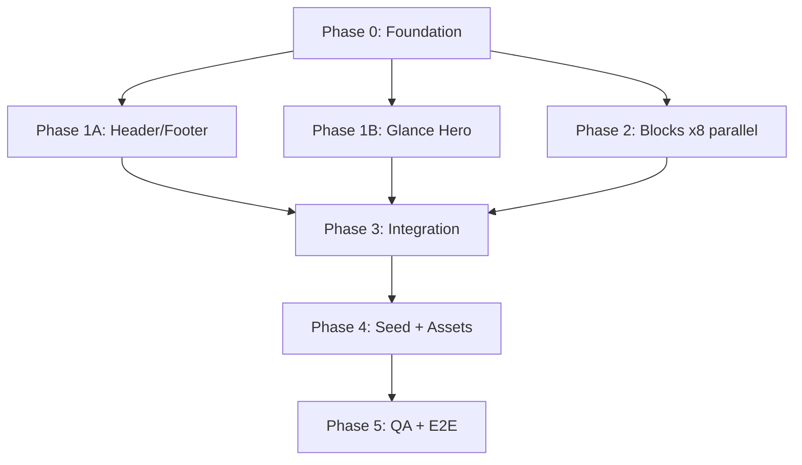

# Glance Home Page — Implementation Plan

> **Status:** Implemented — Phases 0–5 committed on `main`  
> **Brand:** Glance (POC; Figma template uses "Area")  
> **Figma source:** [Modern Product Launch - Payload POC](https://www.figma.com/design/lEM5McyRvPeMRIn4Ce6q0a) (`lEM5McyRvPeMRIn4Ce6q0a`)  
> **Target route:** `/` → CMS page `slug: home`  
> **Stack:** Next.js 16 + Payload 3.85 + SQLite + Tailwind v4 + shadcn/ui

---

## 1. Goals

1. Reproduce the Figma "Modern Product Launch" home page in the existing Payload Website Template.
2. Make **every section fully CMS-editable** via Payload admin (blocks, globals, hero).
3. Use a **design-first, phased build** with parallel subagents for independent components.
4. Keep `/contact` as the CTA target URL (page may not exist yet — acceptable for POC).

### Non-goals (POC scope)

- Pixel-perfect animation or carousel interactions
- Figma Sites publishing pipeline
- Production-ready `/contact` page (links only)
- Replacing Payload admin chrome / AdminBar

---

## 2. Figma Analysis Summary

### 2.1 Responsive frames

| Breakpoint | Frame ID | Width | Notes |
|------------|----------|-------|-------|
| Desktop | `1:118` | 1280px | Primary build target |
| Tablet | `1:274` | 800px | Stack some 2-col layouts |
| Mobile | `1:430` | 375px | Hamburger nav, horizontal scroll for table/steps |

### 2.2 Page sections (top → bottom)

| Order | Figma layer | Proposed Payload entity | Editable? |
|-------|-------------|-------------------------|-----------|
| — | Navigation | `header` global | Yes |
| 1 | Header / Hero | `hero` group (`glanceHero` variant) | Yes |
| 2 | Logo cloud | `logoCloud` block | Yes |
| 3 | Benefits section | `benefits` block | Yes |
| 4 | Features carousel | `featureSplit` block | Yes |
| 5 | Specifications table | `comparisonTable` block | Yes |
| 6 | Testimonial | `testimonial` block | Yes |
| 7 | How it works | `processSteps` block | Yes |
| 8 | Hero image (landscape) | `mediaHero` block | Yes |
| 9 | Centered CTA | `ctaCentered` block | Yes |
| — | Footer | `footer` global | Yes |

### 2.3 Design tokens (from Figma MCP `get_variable_defs`)

#### Colors

| Token | Hex | Usage |
|-------|-----|-------|
| `--glance-primary` | `#485C11` | Primary buttons, eyebrows, checkmarks |
| `--glance-primary-light` | `#DFECC6` | Secondary pill buttons |
| `--glance-mid-green` | `#8E9C78` | Hero device backdrop |
| `--glance-text` | `#000000` | Headlines |
| `--glance-muted` | `#6F6F6F` | Body copy, step numbers |
| `--glance-muted-light` | `#929292` | Large step numbers, table header border |
| `--glance-divider` | `#E9E9E9` | Section borders, table rows |
| `--glance-bg` | `#FFFFFF` | Page background |
| `--glance-on-primary` | `#FFFFFF` | Text on green buttons |

#### Typography (Google Fonts)

| Role | Family | Sizes |
|------|--------|-------|
| Display / H1 | Crimson Text | 160px (hero), 60px (sections) |
| H2 | Crimson Text | 40px |
| H3 | Crimson Text | 18px |
| Body | DM Sans | 15px |
| Captions / Eyebrow | Roboto Mono | 12px |
| Nav / Buttons | DM Sans Bold | 14px |
| Step numbers | DM Sans | 80px (desktop), 64px (mobile) |

#### Layout constants

- Content max-width: **1200px** inside **1280px** frame (40px padding)
- Section vertical rhythm: **80–120px** padding
- Image border-radius: **30px**
- Button border-radius: **1000px** (pill)
- Table border-radius: **20px**
- Column gap: **20px**

#### Button variants

| Variant | Background | Label | Icon | Used in |
|---------|------------|-------|------|---------|
| Primary linkout | `#485C11` | white | ↗ arrow | Nav CTA, final CTA |
| Secondary pill | `#DFECC6` | black | none | "Discover More" |
| Full-width linkout | `#485C11` | white | ↗ | Centered CTA section |

---

## 3. Architecture

### 3.1 Current render pipeline

```
/  →  page.tsx  →  [slug]/page.tsx (slug=home)
                      ├── RenderHero (hero group)
                      ├── RenderBlocks (layout[] blocks)
                      └── layout.tsx → Header + Footer globals
```

### 3.2 Target data model

```
Pages (home)
├── hero: { type: 'glanceHero', headline, media, ... }
└── layout: [
      { blockType: 'logoCloud', ... },
      { blockType: 'benefits', ... },
      { blockType: 'featureSplit', ... },
      { blockType: 'comparisonTable', ... },
      { blockType: 'testimonial', ... },
      { blockType: 'processSteps', ... },
      { blockType: 'mediaHero', ... },
      { blockType: 'ctaCentered', ... },
    ]

Globals
├── header: { logo, navItems[], ctaLink }
└── footer: { logo, navItems[], copyright, legalText }
```

### 3.3 Shared field factories (new)

| File | Purpose |
|------|---------|
| `src/fields/sectionHeader.ts` | eyebrow + heading + description + align |
| `src/fields/iconPicker.ts` | Lucide icon select (cable, earth, account, chart, …) |
| `src/fields/ctaButton.ts` | Extends `link.ts` with `primary` / `secondary` / `linkout` appearances |
| `src/fields/anchorId.ts` | Optional section `id` for in-page nav (`#benefits`, etc.) |

### 3.4 Shared UI components (new)

| Component | Purpose |
|-----------|---------|
| `src/components/SectionHeader/index.tsx` | Renders sectionHeader group |
| `src/components/Icon/index.tsx` | Maps iconPicker value → Lucide |
| `src/components/GlanceButton/index.tsx` | Primary/secondary/linkout button styles |
| `src/components/Logo/Logo.tsx` | CMS logo with Glance text fallback |

---

## 4. Component Specifications

### 4.1 Header global (extend existing)

**Figma:** Floating frosted nav pill (desktop), hamburger drawer (mobile).

**New fields:**

```ts
{
  logo: upload → media,
  navItems: array → link({ appearances: false }),  // existing
  ctaLink: link({ appearances: ['primary'] }),   // "Learn More" → /contact
}
```

**Nav defaults (seed):**

| Label | URL |
|-------|-----|
| Benefits | `#benefits` |
| Specifications | `#specifications` |
| How-to | `#how-to` |
| Contact Us | `/contact` |

**Frontend changes:**

- `Header/Component.client.tsx` — frosted pill nav, mobile hamburger + drawer
- Replace Payload logo with Glance wordmark (DM Sans 30px)
- Client component (`useState` for mobile menu)

**Subagent:** `phase-1-header-footer`

---

### 4.2 Hero — `glanceHero` variant (new)

**Figma node:** `1:120` — "Browse everything." + tablet mockup on green bar.

**Hero config additions** (`src/heros/config.ts`):

```ts
{
  type: 'glanceHero',
  fields: [
    { name: 'headline', type: 'text', required: true },
    { name: 'media', type: 'upload', relationTo: 'media', required: true },
    { name: 'backgroundColor', type: 'text', defaultValue: '#8E9C78' },
  ]
}
```

**Component:** `src/heros/GlanceHero/index.tsx`

- Large Crimson Text headline (responsive clamp)
- Rounded green bar with hero image / device mockup
- No overlap with fixed header (unlike HighImpact `-mt-[10.4rem]`)
- Header theme: `light`

**Seed headline:** `"Browse everything."` (Glance POC — keep Figma copy or customize)

**Subagent:** `phase-1-hero`

---

### 4.3 Block: `logoCloud`

**Figma node:** `1:124`

**Schema:**

```ts
{
  slug: 'logoCloud',
  interfaceName: 'LogoCloudBlock',
  fields: [
    { name: 'label', type: 'text', defaultValue: 'Trusted by:' },
    {
      name: 'logos',
      type: 'array',
      minRows: 1,
      maxRows: 12,
      fields: [
        { name: 'image', type: 'upload', relationTo: 'media', required: true },
        { name: 'alt', type: 'text' },
      ],
    },
    anchorId({ defaultValue: '' }),
  ],
}
```

**Layout:** Flex wrap, 6 logos desktop → 2×3 mobile, opacity 0.6.

**Subagent:** `phase-2-logo-cloud` (parallel)

---

### 4.4 Block: `benefits`

**Figma node:** `1:139`

**Schema:**

```ts
{
  slug: 'benefits',
  fields: [
    sectionHeader(),
    {
      name: 'items',
      type: 'array',
      minRows: 1,
      maxRows: 8,
      fields: [
        iconPicker(),
        { name: 'title', type: 'text', required: true },
        { name: 'description', type: 'textarea', required: true },
      ],
    },
    { name: 'image', type: 'upload', relationTo: 'media', required: true },
    anchorId({ defaultValue: 'benefits' }),
  ],
}
```

**Default content (Glance-adapted from Figma):**

- Eyebrow: "Benefits"
- Headline: "We've cracked the code."
- Subhead: "Glance provides real insights, without the data overload."
- 4 icon cards + mountain landscape image

**Layout:** 4-col grid desktop → 2×2 tablet → 1-col mobile.

**Subagent:** `phase-2-benefits` (parallel)

---

### 4.5 Block: `featureSplit`

**Figma node:** `1:167` — "See the Big Picture"

**Schema:**

```ts
{
  slug: 'featureSplit',
  fields: [
    sectionHeader(),
    {
      name: 'items',
      type: 'array',
      fields: [
        { name: 'number', type: 'text' },      // "01", "02", …
        { name: 'text', type: 'textarea', required: true },
      ],
    },
    ctaButton({ name: 'cta' }),
    { name: 'image', type: 'upload', relationTo: 'media', required: true },
    {
      name: 'imagePosition',
      type: 'select',
      defaultValue: 'right',
      options: ['left', 'right'],
    },
  ],
}
```

**Layout:** 50/50 split desktop; stacked tablet/mobile (text first).

**Subagent:** `phase-2-feature-split` (parallel)

---

### 4.6 Block: `comparisonTable`

**Figma node:** `1:188` — "Why Choose Area?" → **"Why Choose Glance?"**

**Schema:**

```ts
{
  slug: 'comparisonTable',
  fields: [
    sectionHeader(),
    ctaButton({ name: 'cta' }),
    {
      name: 'columns',
      type: 'array',
      minRows: 2,
      maxRows: 4,
      fields: [
        { name: 'name', type: 'text', required: true },
        { name: 'highlighted', type: 'checkbox', defaultValue: false },
        {
          name: 'features',
          type: 'array',
          fields: [
            { name: 'included', type: 'checkbox', defaultValue: true },
            { name: 'label', type: 'text', required: true },
          ],
        },
      ],
    },
    anchorId({ defaultValue: 'specifications' }),
  ],
}
```

**Seed data (column-centric, from Figma):**

| Row | Glance ✓ | WebSurge | HyperView |
|-----|----------|----------|-----------|
| 1 | Ultra-fast browsing | Fast browsing | Moderate speeds ✕ |
| 2 | Advanced AI insights | Basic AI recommendations | No AI assistance ✕ |
| 3 | Seamless integration | Restricts customization | Steep learning curve ✕ |
| 4 | Advanced AI insights | Basic AI insights ✕ | No AI assistance ✕ |
| 5 | Ultra-fast browsing | Fast browsing | Moderate speeds ✕ |
| 6 | Full UTF-8 support | Potential display errors ✕ | Partial UTF-8 support ✕ |

**Layout:** 3 equal columns; Glance column highlighted (white card + shadow); horizontal scroll on mobile.

**Subagent:** `phase-2-comparison-table` (parallel)

---

### 4.7 Block: `testimonial`

**Figma node:** `1:223`

**Schema:**

```ts
{
  slug: 'testimonial',
  fields: [
    { name: 'image', type: 'upload', relationTo: 'media', required: true },
    { name: 'quote', type: 'textarea', required: true },
    { name: 'authorName', type: 'text', required: true },
    { name: 'authorTitle', type: 'text' },
  ],
}
```

**Layout:** Image | quote side-by-side desktop; stacked mobile.

**Subagent:** `phase-2-testimonial` (parallel)

---

### 4.8 Block: `processSteps`

**Figma node:** `1:230` — "Map Your Success"

**Schema:**

```ts
{
  slug: 'processSteps',
  fields: [
    { name: 'headline', type: 'text', required: true },
    ctaButton({ name: 'cta' }),
    {
      name: 'steps',
      type: 'array',
      minRows: 1,
      maxRows: 6,
      fields: [
        { name: 'number', type: 'text' },
        { name: 'title', type: 'text', required: true },
        { name: 'description', type: 'textarea' },
      ],
    },
    anchorId({ defaultValue: 'how-to' }),
  ],
}
```

**Layout:** 3-up grid desktop; horizontal scroll cards on mobile.

**Subagent:** `phase-2-process-steps` (parallel)

---

### 4.9 Block: `mediaHero`

**Figma node:** `1:250` — full-width landscape

**Schema:**

```ts
{
  slug: 'mediaHero',
  fields: [
    { name: 'media', type: 'upload', relationTo: 'media', required: true },
    { name: 'alt', type: 'text' },
  ],
}
```

**Note:** Could extend existing `mediaBlock` with a `variant: 'fullWidth'` field instead of a new block — decision left to implementer; separate block keeps admin UX clearer.

**Subagent:** `phase-2-media-hero` (parallel)

---

### 4.10 Block: `ctaCentered`

**Figma node:** `1:253` — "Connect with us"

**Schema:**

```ts
{
  slug: 'ctaCentered',
  fields: [
    sectionHeader({ richTextDescription: false }),
    ctaButton({ name: 'cta', fullWidth: true }),
    anchorId({ defaultValue: 'contact' }),
  ],
}
```

**Seed CTA:** "Learn More" → `/contact`

**Subagent:** `phase-2-cta-centered` (parallel)

---

### 4.11 Footer global (extend existing)

**New fields:**

```ts
{
  logo: upload → media,
  navItems: array → link(),           // existing
  copyrightName: text,                // "Glance"
  year: number,                       // 2025
  legalText: text,                    // "All Rights Reserved"
}
```

**Subagent:** `phase-1-header-footer` (same agent as header)

---

## 5. Build Phases & Subagent Plan



### Phase 0 — Foundation (1 subagent, sequential first)

**Agent ID suggestion:** `phase-0-foundation`

| Task | Files |
|------|-------|
| Add Glance CSS tokens + fonts | `globals.css`, `layout.tsx` |
| Create field factories | `src/fields/sectionHeader.ts`, `iconPicker.ts`, `ctaButton.ts`, `anchorId.ts` |
| Create shared UI | `SectionHeader`, `Icon`, `GlanceButton` |
| Fix home slug in CMSLink | `src/components/Link/index.tsx` |
| Add `@source inline` safelist entries | `globals.css` |

**Exit criteria:** Field factories importable; fonts load; tokens visible in Storybook or dev page.

---

### Phase 1A — Header & Footer (1 subagent)

**Depends on:** Phase 0  
**Agent:** `phase-1-header-footer`

| Task | Files |
|------|-------|
| Extend Header/Footer configs | `Header/config.ts`, `Footer/config.ts` |
| Rebuild Header client UI | `Header/Component.client.tsx`, `Header/Nav/index.tsx` |
| Rebuild Footer UI | `Footer/Component.tsx` |
| Update Logo component | `components/Logo/Logo.tsx` |
| Seed globals | `endpoints/seed/index.ts` |

**Exit criteria:** Floating nav + mobile menu; Glance wordmark; footer matches Figma structure.

---

### Phase 1B — Glance Hero (1 subagent)

**Depends on:** Phase 0  
**Agent:** `phase-1-hero`

| Task | Files |
|------|-------|
| Add `glanceHero` to hero config | `heros/config.ts` |
| Build GlanceHero component | `heros/GlanceHero/index.tsx` |
| Register in RenderHero | `heros/RenderHero.tsx` |
| Adjust header theme on home | `[slug]/page.client.tsx` if needed |

**Exit criteria:** Hero renders headline + image bar; editable in admin Hero tab.

---

### Phase 2 — Layout Blocks (8 parallel subagents)

**Depends on:** Phase 0 (field factories must exist)  
**Can run in parallel** — no cross-block file conflicts.

| Subagent | Block slug | Folder |
|----------|------------|--------|
| `phase-2-logo-cloud` | `logoCloud` | `src/blocks/LogoCloud/` |
| `phase-2-benefits` | `benefits` | `src/blocks/Benefits/` |
| `phase-2-feature-split` | `featureSplit` | `src/blocks/FeatureSplit/` |
| `phase-2-comparison-table` | `comparisonTable` | `src/blocks/ComparisonTable/` |
| `phase-2-testimonial` | `testimonial` | `src/blocks/Testimonial/` |
| `phase-2-process-steps` | `processSteps` | `src/blocks/ProcessSteps/` |
| `phase-2-media-hero` | `mediaHero` | `src/blocks/MediaHero/` |
| `phase-2-cta-centered` | `ctaCentered` | `src/blocks/CtaCentered/` |

**Each subagent deliverable:**

1. `config.ts` — Payload block schema
2. `Component.tsx` — responsive React component
3. `data-testid={`block-${slug}`}` on root element
4. Uses shared: `SectionHeader`, `GlanceButton`, `Media`, `Icon`, `cn()`, `container`

**Exit criteria:** Each block renders in isolation when passed mock props.

---

### Phase 3 — Integration (1 subagent, sequential)

**Depends on:** Phase 1 + all Phase 2 blocks  
**Agent:** `phase-3-integration`

| Task | Files |
|------|-------|
| Register all blocks in Pages collection | `collections/Pages/index.ts` |
| Register in RenderBlocks | `blocks/RenderBlocks.tsx` |
| Adjust block wrapper spacing | `RenderBlocks.tsx` (`my-16` may need tuning → `my-0` + per-block padding) |
| Run type generation | `pnpm generate:types` |
| Lint | `pnpm lint:fix` |

**Exit criteria:** All blocks appear in admin block picker; no TypeScript errors.

---

### Phase 4 — Seed & Assets (1 subagent)

**Depends on:** Phase 3  
**Agent:** `phase-4-seed-assets`

| Task | Files |
|------|-------|
| Download Figma assets via MCP | `download_assets` → `public/media/` |
| Create media seed metadata | `endpoints/seed/glance-*.ts` |
| Rewrite home seed layout | `endpoints/seed/home.ts` |
| Update header/footer seed | `endpoints/seed/index.ts` |
| Update home-static fallback | `endpoints/seed/home-static.ts` |
| Create lexical seed helpers | `endpoints/seed/helpers/lexical.ts` |

**Home layout order (seed):**

```ts
layout: [
  { blockType: 'logoCloud', ... },
  { blockType: 'benefits', ... },
  { blockType: 'featureSplit', ... },
  { blockType: 'comparisonTable', ... },
  { blockType: 'testimonial', ... },
  { blockType: 'processSteps', ... },
  { blockType: 'mediaHero', ... },
  { blockType: 'ctaCentered', ... },
]
hero: { type: 'glanceHero', headline: 'Browse everything.', media: heroImageId }
```

**Exit criteria:** Seed button in admin populates full Glance home; `/` matches Figma structure.

---

### Phase 5 — QA & Testing (1 subagent)

**Depends on:** Phase 4  
**Agent:** `phase-5-qa`

| Task | Files |
|------|-------|
| E2E home page tests | `tests/e2e/glance-home.e2e.spec.ts` |
| Visual compare vs Figma screenshot | Manual + optional Playwright screenshot |
| Responsive check | Desktop / tablet / mobile viewports |
| Live preview smoke test | Admin → Pages → Home → Preview |
| Fix CMSLink `/contact` 404 | Acceptable — test link href only |

**Exit criteria:** E2E passes; major sections visible; admin live preview works.

---

## 6. File Tree (net-new / modified)

```
docs/
  GLANCE_HOME_PAGE_PLAN.md          ← this file

src/
  fields/
    sectionHeader.ts                 NEW
    iconPicker.ts                    NEW
    ctaButton.ts                     NEW
    anchorId.ts                      NEW

  components/
    SectionHeader/index.tsx          NEW
    Icon/index.tsx                   NEW
    GlanceButton/index.tsx           NEW
    Logo/Logo.tsx                    MODIFY
    Link/index.tsx                   MODIFY (home slug fix)

  heros/
    config.ts                        MODIFY
    RenderHero.tsx                   MODIFY
    GlanceHero/index.tsx             NEW

  blocks/
    LogoCloud/                       NEW
    Benefits/                        NEW
    FeatureSplit/                    NEW
    ComparisonTable/                 NEW
    Testimonial/                     NEW
    ProcessSteps/                    NEW
    MediaHero/                       NEW
    CtaCentered/                     NEW
    RenderBlocks.tsx                 MODIFY

  Header/                            MODIFY (config + components)
  Footer/                            MODIFY (config + components)

  collections/Pages/index.ts         MODIFY

  app/(frontend)/
    globals.css                      MODIFY (tokens, fonts)
    layout.tsx                       MODIFY (Google Fonts)
    [slug]/page.client.tsx           MODIFY (header theme)

  endpoints/seed/
    home.ts                          MODIFY
    home-static.ts                   MODIFY
    index.ts                         MODIFY
    helpers/lexical.ts               NEW
    glance-*.ts                      NEW (media metadata)

tests/e2e/
  glance-home.e2e.spec.ts            NEW
```

---

## 7. Tools & Skills Reference

### Required (already available)

| Tool / Skill | Use |
|--------------|-----|
| **Figma MCP** (`get_design_context`, `get_variable_defs`, `get_screenshot`, `download_assets`) | Design reference, asset export |
| **Payload skill** (`.agents/skills/payload/`) | Blocks, fields, hooks, access |
| **Next.js App Router** | Server components, `getPayload`, draft mode |
| **Tailwind v4 + shadcn** | Styling (project convention) |
| **lucide-react** | Icons for iconPicker |
| **Cursor subagents** | Parallel block implementation |

### Optional / nice-to-have

| Tool | Use | Needed? |
|------|-----|---------|
| Playwright MCP / skill | E2E verification | Already in project via `pnpm test:e2e` |
| Figma `generate_figma_design` | Reverse sync code → Figma | No |
| Storybook | Component isolation | No (POC) |
| `@next/font` | Font optimization | Yes — via `next/font/google` |

### Figma MCP workflow per block

1. `get_design_context` on section node ID
2. `download_assets` for images in that section
3. Map generated Tailwind reference → project tokens (do **not** install Tailwind separately)
4. Implement Payload schema from section field inventory (Section 4)

---

## 8. Subagent Prompt Template

Each Phase 2 subagent should receive:

```
Project: /Users/jose.mejia/projects/payload-poc
Plan: docs/GLANCE_HOME_PAGE_PLAN.md
Block: [blockName] (Section 4.x)

Read first:
- .agents/skills/payload/SKILL.md
- src/blocks/Content/config.ts + Component.tsx (pattern)
- src/fields/sectionHeader.ts (Phase 0 output)

Figma file: lEM5McyRvPeMRIn4Ce6q0a
Figma node: [nodeId from plan]

Deliver:
1. src/blocks/[Name]/config.ts
2. src/blocks/[Name]/Component.tsx
3. Responsive layout matching Figma Desktop/Tablet/Mobile
4. data-testid on root element
5. Use Glance brand tokens from globals.css

Do NOT register in Pages or RenderBlocks (Phase 3 does that).
Do NOT run generate:types.
```

---

## 9. Risks & Decisions

| Item | Decision | Notes |
|------|----------|-------|
| Brand copy | Replace "Area" → "Glance" in seed; keep competitor names | POC |
| `/contact` 404 | Acceptable | Link href only |
| Comparison table duplicate rows | Keep Figma data as-is | May dedupe later |
| Carousel interaction | Static image only | No JS carousel for POC |
| iPad mockup in hero | Single uploaded image | Not built as CSS frame |
| Existing template blocks | Keep registered | Don't remove `content`, `cta`, etc. |
| RenderBlocks `my-16` | Likely reduce to per-block padding | Figma uses 120px section gaps |
| Dynamic Tailwind classes | Must safelist in globals.css | Project constraint |

---

## 10. Acceptance Criteria

- [ ] `/` renders all 9 content sections + header + footer
- [ ] Every section editable in Payload admin without code changes
- [ ] Responsive at 1280 / 800 / 375 viewports
- [ ] Glance colors and fonts match Figma tokens (± reasonable POC tolerance)
- [ ] CTAs link to `/contact` where designed
- [ ] In-page nav anchors work (`#benefits`, `#specifications`, `#how-to`, `#contact`)
- [ ] Live preview updates on save
- [ ] Seed populates demo content
- [ ] E2E test confirms hero + blocks render

---

## 11. Estimated Effort

| Phase | Subagents | Estimate |
|-------|-----------|----------|
| 0 Foundation | 1 | ~2–3 hours |
| 1 Header/Footer + Hero | 2 | ~3–4 hours |
| 2 Blocks (×8 parallel) | 8 | ~4–6 hours wall-clock |
| 3 Integration | 1 | ~1 hour |
| 4 Seed + Assets | 1 | ~2 hours |
| 5 QA | 1 | ~1–2 hours |
| **Total** | **14 agent runs** | **~1–2 days** |

---

## 12. Approval Gate

**No code will be written until you approve this plan.**

Reply with:

1. **"Approved"** — proceed with Phase 0, then parallel phases as outlined
2. **Changes** — section/block naming, scope cuts, or priority adjustments
3. **Questions** — anything in Section 9 needing your input

---

## Appendix A — Figma Node Reference

| Section | Desktop node |
|---------|--------------|
| Full page | `1:118` |
| Navigation | `1:119` |
| Hero | `1:120` |
| Logo cloud | `1:124` |
| Benefits | `1:139` |
| Feature split | `1:167` |
| Comparison table | `1:188` |
| Testimonial | `1:223` |
| Process steps | `1:230` |
| Media hero | `1:250` |
| Centered CTA | `1:253` |
| Footer | `1:257` |

## Appendix B — Subagent Analysis Sources

- Figma deep analysis: subagent `013543a2-e2c3-4f30-a4f0-c657ed9ec258`
- Payload build process: subagent `044f3d0c-7ae7-4129-af4c-a483c1a989b9`
