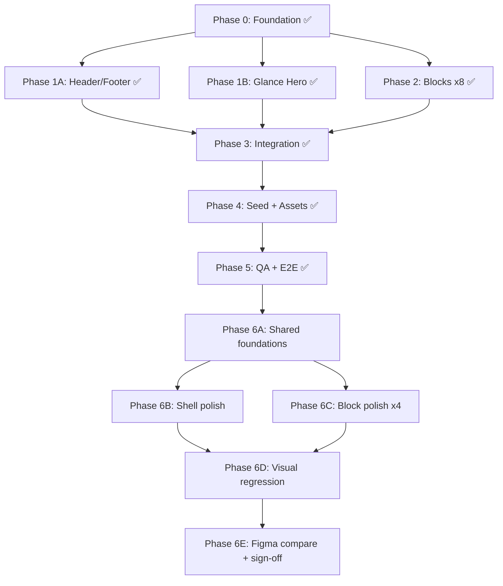
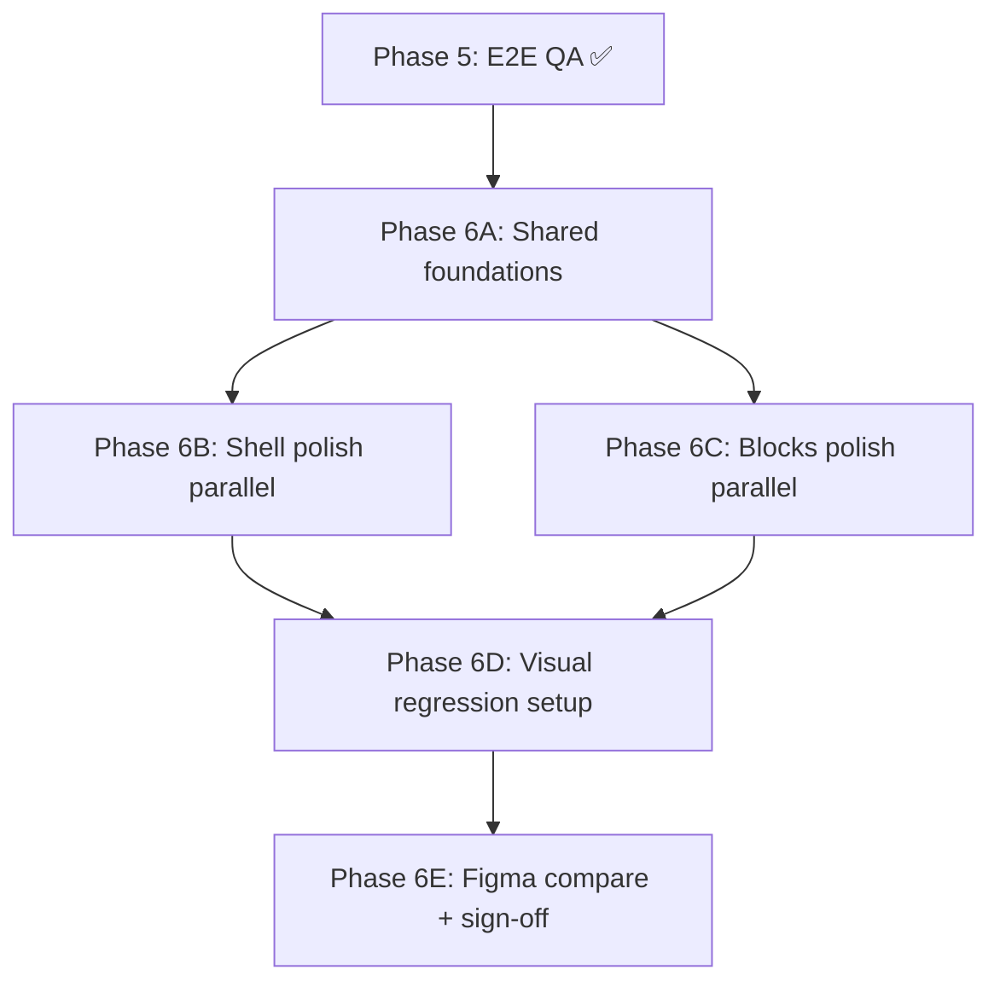

# Glance Home Page — Implementation Plan

> **Status:** Phases 0–5 implemented — **Phase 6 visual polish in progress**  
> **Last audit:** 2026-06-16 — subagents identified 37+ concrete UI gaps vs Figma  
> **Brand:** Glance (POC; Figma template uses "Area")  
> **Figma source:** [Modern Product Launch - Payload POC](https://www.figma.com/design/lEM5McyRvPeMRIn4Ce6q0a) (`lEM5McyRvPeMRIn4Ce6q0a`)  
> **Target route:** `/` → CMS page `slug: home`  
> **Stack:** Next.js 16 + Payload 3.85 + SQLite + Tailwind v4 + shadcn/ui

---

## 1. Goals

1. Reproduce the Figma "Modern Product Launch" home page in the existing Payload Website Template.
2. Make **every section fully CMS-editable** via Payload admin (blocks, globals, hero).
3. Use a **design-first, phased build** with parallel subagents for independent components.
4. Keep `/contact` as the CTA target URL (page may not exist yet — acceptable for POC).

### Non-goals (POC scope)

- Pixel-perfect animation or carousel interactions
- Figma Sites publishing pipeline
- Production-ready `/contact` page (links only)
- Replacing Payload admin chrome / AdminBar
- CI gates on raw Figma pixel equality (font rendering differs; use self-baseline + relaxed Figma compare)

### Phase 6 goals (new)

1. Close the largest visual gaps identified in the subagent audit (typography, spacing, layout structure).
2. Standardize horizontal padding (`40px` desktop / `16px` mobile) and section rhythm across all blocks.
3. Add Playwright visual regression per section at 1280 / 800 / 375 viewports.
4. Store Figma MCP screenshots as design gold masters for side-by-side review.
5. Target **≤5% pixel diff vs Figma** on desktop section shots (manual sign-off); **≤2% self-baseline** for CI regression.

---

## 2. Figma Analysis Summary

### 2.1 Responsive frames

| Breakpoint | Frame ID | Width | Notes |
|------------|----------|-------|-------|
| Desktop | `1:118` | 1280px | Primary build target |
| Tablet | `1:274` | 800px | Stack some 2-col layouts |
| Mobile | `1:430` | 375px | Hamburger nav, horizontal scroll for table/steps |

### 2.2 Page sections (top → bottom)

| Order | Figma layer | Proposed Payload entity | Editable? |
|-------|-------------|-------------------------|-----------|
| — | Navigation | `header` global | Yes |
| 1 | Header / Hero | `hero` group (`glanceHero` variant) | Yes |
| 2 | Logo cloud | `logoCloud` block | Yes |
| 3 | Benefits section | `benefits` block | Yes |
| 4 | Features carousel | `featureSplit` block | Yes |
| 5 | Specifications table | `comparisonTable` block | Yes |
| 6 | Testimonial | `testimonial` block | Yes |
| 7 | How it works | `processSteps` block | Yes |
| 8 | Hero image (landscape) | `mediaHero` block | Yes |
| 9 | Centered CTA | `ctaCentered` block | Yes |
| — | Footer | `footer` global | Yes |

### 2.3 Design tokens (from Figma MCP `get_variable_defs`)

#### Colors

| Token | Hex | Usage |
|-------|-----|-------|
| `--glance-primary` | `#485C11` | Primary buttons, eyebrows, checkmarks |
| `--glance-primary-light` | `#DFECC6` | Secondary pill buttons |
| `--glance-mid-green` | `#8E9C78` | Hero device backdrop |
| `--glance-text` | `#000000` | Headlines |
| `--glance-muted` | `#6F6F6F` | Body copy, step numbers |
| `--glance-muted-light` | `#929292` | Large step numbers, table header border |
| `--glance-divider` | `#E9E9E9` | Section borders, table rows |
| `--glance-bg` | `#FFFFFF` | Page background |
| `--glance-on-primary` | `#FFFFFF` | Text on green buttons |

#### Typography (Google Fonts)

| Role | Family | Sizes |
|------|--------|-------|
| Display / H1 | Crimson Text | 160px (hero), 60px (sections) |
| H2 | Crimson Text | 40px |
| H3 | Crimson Text | 18px |
| Body | DM Sans | 15px |
| Captions / Eyebrow | Roboto Mono | 12px |
| Nav / Buttons | DM Sans Bold | 14px |
| Step numbers | DM Sans | 80px (desktop), 64px (mobile) |

#### Layout constants

- Content max-width: **1200px** inside **1280px** frame (40px padding)
- Section vertical rhythm: **80–120px** padding
- Image border-radius: **30px**
- Button border-radius: **1000px** (pill)
- Table border-radius: **20px**
- Column gap: **20px**

#### Button variants

| Variant | Background | Label | Icon | Used in |
|---------|------------|-------|------|---------|
| Primary linkout | `#485C11` | white | ↗ arrow | Nav CTA, final CTA |
| Secondary pill | `#DFECC6` | black | none | "Discover More" |
| Full-width linkout | `#485C11` | white | ↗ | Centered CTA section |

---

## 3. Architecture

### 3.1 Current render pipeline

```
/  →  page.tsx  →  [slug]/page.tsx (slug=home)
                      ├── RenderHero (hero group)
                      ├── RenderBlocks (layout[] blocks)
                      └── layout.tsx → Header + Footer globals
```

### 3.2 Target data model

```
Pages (home)
├── hero: { type: 'glanceHero', headline, media, ... }
└── layout: [
      { blockType: 'logoCloud', ... },
      { blockType: 'benefits', ... },
      { blockType: 'featureSplit', ... },
      { blockType: 'comparisonTable', ... },
      { blockType: 'testimonial', ... },
      { blockType: 'processSteps', ... },
      { blockType: 'mediaHero', ... },
      { blockType: 'ctaCentered', ... },
    ]

Globals
├── header: { logo, navItems[], ctaLink }
└── footer: { logo, navItems[], copyright, legalText }
```

### 3.3 Shared field factories (new)

| File | Purpose |
|------|---------|
| `src/fields/sectionHeader.ts` | eyebrow + heading + description + align |
| `src/fields/iconPicker.ts` | Lucide icon select (cable, earth, account, chart, …) |
| `src/fields/ctaButton.ts` | Extends `link.ts` with `primary` / `secondary` / `linkout` appearances |
| `src/fields/anchorId.ts` | Optional section `id` for in-page nav (`#benefits`, etc.) |

### 3.4 Shared UI components (new)

| Component | Purpose |
|-----------|---------|
| `src/components/SectionHeader/index.tsx` | Renders sectionHeader group |
| `src/components/Icon/index.tsx` | Maps iconPicker value → Lucide |
| `src/components/GlanceButton/index.tsx` | Primary/secondary/linkout button styles |
| `src/components/Logo/Logo.tsx` | CMS logo with Glance text fallback |

---

## 4. Component Specifications

### 4.1 Header global (extend existing)

**Figma:** Floating frosted nav pill (desktop), hamburger drawer (mobile).

**New fields:**

```ts
{
  logo: upload → media,
  navItems: array → link({ appearances: false }),  // existing
  ctaLink: link({ appearances: ['primary'] }),   // "Learn More" → /contact
}
```

**Nav defaults (seed):**

| Label | URL |
|-------|-----|
| Benefits | `#benefits` |
| Specifications | `#specifications` |
| How-to | `#how-to` |
| Contact Us | `/contact` |

**Frontend changes:**

- `Header/Component.client.tsx` — frosted pill nav, mobile hamburger + drawer
- Replace Payload logo with Glance wordmark (DM Sans 30px)
- Client component (`useState` for mobile menu)

**Subagent:** `phase-1-header-footer`

---

### 4.2 Hero — `glanceHero` variant (new)

**Figma node:** `1:120` — "Browse everything." + tablet mockup on green bar.

**Hero config additions** (`src/heros/config.ts`):

```ts
{
  type: 'glanceHero',
  fields: [
    { name: 'headline', type: 'text', required: true },
    { name: 'media', type: 'upload', relationTo: 'media', required: true },
    { name: 'backgroundColor', type: 'text', defaultValue: '#8E9C78' },
  ]
}
```

**Component:** `src/heros/GlanceHero/index.tsx`

- Large Crimson Text headline (responsive clamp)
- Rounded green bar with hero image / device mockup
- No overlap with fixed header (unlike HighImpact `-mt-[10.4rem]`)
- Header theme: `light`

**Seed headline:** `"Browse everything."` (Glance POC — keep Figma copy or customize)

**Subagent:** `phase-1-hero`

---

### 4.3 Block: `logoCloud`

**Figma node:** `1:124`

**Schema:**

```ts
{
  slug: 'logoCloud',
  interfaceName: 'LogoCloudBlock',
  fields: [
    { name: 'label', type: 'text', defaultValue: 'Trusted by:' },
    {
      name: 'logos',
      type: 'array',
      minRows: 1,
      maxRows: 12,
      fields: [
        { name: 'image', type: 'upload', relationTo: 'media', required: true },
        { name: 'alt', type: 'text' },
      ],
    },
    anchorId({ defaultValue: '' }),
  ],
}
```

**Layout:** Flex wrap, 6 logos desktop → 2×3 mobile, opacity 0.6.

**Subagent:** `phase-2-logo-cloud` (parallel)

---

### 4.4 Block: `benefits`

**Figma node:** `1:139`

**Schema:**

```ts
{
  slug: 'benefits',
  fields: [
    sectionHeader(),
    {
      name: 'items',
      type: 'array',
      minRows: 1,
      maxRows: 8,
      fields: [
        iconPicker(),
        { name: 'title', type: 'text', required: true },
        { name: 'description', type: 'textarea', required: true },
      ],
    },
    { name: 'image', type: 'upload', relationTo: 'media', required: true },
    anchorId({ defaultValue: 'benefits' }),
  ],
}
```

**Default content (Glance-adapted from Figma):**

- Eyebrow: "Benefits"
- Headline: "We've cracked the code."
- Subhead: "Glance provides real insights, without the data overload."
- 4 icon cards + mountain landscape image

**Layout:** 4-col grid desktop → 2×2 tablet → 1-col mobile.

**Subagent:** `phase-2-benefits` (parallel)

---

### 4.5 Block: `featureSplit`

**Figma node:** `1:167` — "See the Big Picture"

**Schema:**

```ts
{
  slug: 'featureSplit',
  fields: [
    sectionHeader(),
    {
      name: 'items',
      type: 'array',
      fields: [
        { name: 'number', type: 'text' },      // "01", "02", …
        { name: 'text', type: 'textarea', required: true },
      ],
    },
    ctaButton({ name: 'cta' }),
    { name: 'image', type: 'upload', relationTo: 'media', required: true },
    {
      name: 'imagePosition',
      type: 'select',
      defaultValue: 'right',
      options: ['left', 'right'],
    },
  ],
}
```

**Layout:** 50/50 split desktop; stacked tablet/mobile (text first).

**Subagent:** `phase-2-feature-split` (parallel)

---

### 4.6 Block: `comparisonTable`

**Figma node:** `1:188` — "Why Choose Area?" → **"Why Choose Glance?"**

**Schema:**

```ts
{
  slug: 'comparisonTable',
  fields: [
    sectionHeader(),
    ctaButton({ name: 'cta' }),
    {
      name: 'columns',
      type: 'array',
      minRows: 2,
      maxRows: 4,
      fields: [
        { name: 'name', type: 'text', required: true },
        { name: 'highlighted', type: 'checkbox', defaultValue: false },
        {
          name: 'features',
          type: 'array',
          fields: [
            { name: 'included', type: 'checkbox', defaultValue: true },
            { name: 'label', type: 'text', required: true },
          ],
        },
      ],
    },
    anchorId({ defaultValue: 'specifications' }),
  ],
}
```

**Seed data (column-centric, from Figma):**

| Row | Glance ✓ | WebSurge | HyperView |
|-----|----------|----------|-----------|
| 1 | Ultra-fast browsing | Fast browsing | Moderate speeds ✕ |
| 2 | Advanced AI insights | Basic AI recommendations | No AI assistance ✕ |
| 3 | Seamless integration | Restricts customization | Steep learning curve ✕ |
| 4 | Advanced AI insights | Basic AI insights ✕ | No AI assistance ✕ |
| 5 | Ultra-fast browsing | Fast browsing | Moderate speeds ✕ |
| 6 | Full UTF-8 support | Potential display errors ✕ | Partial UTF-8 support ✕ |

**Layout:** 3 equal columns; Glance column highlighted (white card + shadow); horizontal scroll on mobile.

**Subagent:** `phase-2-comparison-table` (parallel)

---

### 4.7 Block: `testimonial`

**Figma node:** `1:223`

**Schema:**

```ts
{
  slug: 'testimonial',
  fields: [
    { name: 'image', type: 'upload', relationTo: 'media', required: true },
    { name: 'quote', type: 'textarea', required: true },
    { name: 'authorName', type: 'text', required: true },
    { name: 'authorTitle', type: 'text' },
  ],
}
```

**Layout:** Image | quote side-by-side desktop; stacked mobile.

**Subagent:** `phase-2-testimonial` (parallel)

---

### 4.8 Block: `processSteps`

**Figma node:** `1:230` — "Map Your Success"

**Schema:**

```ts
{
  slug: 'processSteps',
  fields: [
    { name: 'headline', type: 'text', required: true },
    ctaButton({ name: 'cta' }),
    {
      name: 'steps',
      type: 'array',
      minRows: 1,
      maxRows: 6,
      fields: [
        { name: 'number', type: 'text' },
        { name: 'title', type: 'text', required: true },
        { name: 'description', type: 'textarea' },
      ],
    },
    anchorId({ defaultValue: 'how-to' }),
  ],
}
```

**Layout:** 3-up grid desktop; horizontal scroll cards on mobile.

**Subagent:** `phase-2-process-steps` (parallel)

---

### 4.9 Block: `mediaHero`

**Figma node:** `1:250` — full-width landscape

**Schema:**

```ts
{
  slug: 'mediaHero',
  fields: [
    { name: 'media', type: 'upload', relationTo: 'media', required: true },
    { name: 'alt', type: 'text' },
  ],
}
```

**Note:** Could extend existing `mediaBlock` with a `variant: 'fullWidth'` field instead of a new block — decision left to implementer; separate block keeps admin UX clearer.

**Subagent:** `phase-2-media-hero` (parallel)

---

### 4.10 Block: `ctaCentered`

**Figma node:** `1:253` — "Connect with us"

**Schema:**

```ts
{
  slug: 'ctaCentered',
  fields: [
    sectionHeader({ richTextDescription: false }),
    ctaButton({ name: 'cta', fullWidth: true }),
    anchorId({ defaultValue: 'contact' }),
  ],
}
```

**Seed CTA:** "Learn More" → `/contact`

**Subagent:** `phase-2-cta-centered` (parallel)

---

### 4.11 Footer global (extend existing)

**New fields:**

```ts
{
  logo: upload → media,
  navItems: array → link(),           // existing
  copyrightName: text,                // "Glance"
  year: number,                       // 2025
  legalText: text,                    // "All Rights Reserved"
}
```

**Subagent:** `phase-1-header-footer` (same agent as header)

---

## 5. Build Phases & Subagent Plan



### Phase 0 — Foundation (1 subagent, sequential first)

**Agent ID suggestion:** `phase-0-foundation`

| Task | Files |
|------|-------|
| Add Glance CSS tokens + fonts | `globals.css`, `layout.tsx` |
| Create field factories | `src/fields/sectionHeader.ts`, `iconPicker.ts`, `ctaButton.ts`, `anchorId.ts` |
| Create shared UI | `SectionHeader`, `Icon`, `GlanceButton` |
| Fix home slug in CMSLink | `src/components/Link/index.tsx` |
| Add `@source inline` safelist entries | `globals.css` |

**Exit criteria:** Field factories importable; fonts load; tokens visible in Storybook or dev page.

---

### Phase 1A — Header & Footer (1 subagent)

**Depends on:** Phase 0  
**Agent:** `phase-1-header-footer`

| Task | Files |
|------|-------|
| Extend Header/Footer configs | `Header/config.ts`, `Footer/config.ts` |
| Rebuild Header client UI | `Header/Component.client.tsx`, `Header/Nav/index.tsx` |
| Rebuild Footer UI | `Footer/Component.tsx` |
| Update Logo component | `components/Logo/Logo.tsx` |
| Seed globals | `endpoints/seed/index.ts` |

**Exit criteria:** Floating nav + mobile menu; Glance wordmark; footer matches Figma structure.

---

### Phase 1B — Glance Hero (1 subagent)

**Depends on:** Phase 0  
**Agent:** `phase-1-hero`

| Task | Files |
|------|-------|
| Add `glanceHero` to hero config | `heros/config.ts` |
| Build GlanceHero component | `heros/GlanceHero/index.tsx` |
| Register in RenderHero | `heros/RenderHero.tsx` |
| Adjust header theme on home | `[slug]/page.client.tsx` if needed |

**Exit criteria:** Hero renders headline + image bar; editable in admin Hero tab.

---

### Phase 2 — Layout Blocks (8 parallel subagents)

**Depends on:** Phase 0 (field factories must exist)  
**Can run in parallel** — no cross-block file conflicts.

| Subagent | Block slug | Folder |
|----------|------------|--------|
| `phase-2-logo-cloud` | `logoCloud` | `src/blocks/LogoCloud/` |
| `phase-2-benefits` | `benefits` | `src/blocks/Benefits/` |
| `phase-2-feature-split` | `featureSplit` | `src/blocks/FeatureSplit/` |
| `phase-2-comparison-table` | `comparisonTable` | `src/blocks/ComparisonTable/` |
| `phase-2-testimonial` | `testimonial` | `src/blocks/Testimonial/` |
| `phase-2-process-steps` | `processSteps` | `src/blocks/ProcessSteps/` |
| `phase-2-media-hero` | `mediaHero` | `src/blocks/MediaHero/` |
| `phase-2-cta-centered` | `ctaCentered` | `src/blocks/CtaCentered/` |

**Each subagent deliverable:**

1. `config.ts` — Payload block schema
2. `Component.tsx` — responsive React component
3. `data-testid={`block-${slug}`}` on root element
4. Uses shared: `SectionHeader`, `GlanceButton`, `Media`, `Icon`, `cn()`, `container`

**Exit criteria:** Each block renders in isolation when passed mock props.

---

### Phase 3 — Integration (1 subagent, sequential)

**Depends on:** Phase 1 + all Phase 2 blocks  
**Agent:** `phase-3-integration`

| Task | Files |
|------|-------|
| Register all blocks in Pages collection | `collections/Pages/index.ts` |
| Register in RenderBlocks | `blocks/RenderBlocks.tsx` |
| Adjust block wrapper spacing | `RenderBlocks.tsx` (`my-16` may need tuning → `my-0` + per-block padding) |
| Run type generation | `pnpm generate:types` |
| Lint | `pnpm lint:fix` |

**Exit criteria:** All blocks appear in admin block picker; no TypeScript errors.

---

### Phase 4 — Seed & Assets (1 subagent)

**Depends on:** Phase 3  
**Agent:** `phase-4-seed-assets`

| Task | Files |
|------|-------|
| Download Figma assets via MCP | `download_assets` → `public/media/` |
| Create media seed metadata | `endpoints/seed/glance-*.ts` |
| Rewrite home seed layout | `endpoints/seed/home.ts` |
| Update header/footer seed | `endpoints/seed/index.ts` |
| Update home-static fallback | `endpoints/seed/home-static.ts` |
| Create lexical seed helpers | `endpoints/seed/helpers/lexical.ts` |

**Home layout order (seed):**

```ts
layout: [
  { blockType: 'logoCloud', ... },
  { blockType: 'benefits', ... },
  { blockType: 'featureSplit', ... },
  { blockType: 'comparisonTable', ... },
  { blockType: 'testimonial', ... },
  { blockType: 'processSteps', ... },
  { blockType: 'mediaHero', ... },
  { blockType: 'ctaCentered', ... },
]
hero: { type: 'glanceHero', headline: 'Browse everything.', media: heroImageId }
```

**Exit criteria:** Seed button in admin populates full Glance home; `/` matches Figma structure.

---

### Phase 5 — QA & Testing (1 subagent)

**Depends on:** Phase 4  
**Agent:** `phase-5-qa`

| Task | Files |
|------|-------|
| E2E home page tests | `tests/e2e/glance-home.e2e.spec.ts` |
| Visual compare vs Figma screenshot | Manual + optional Playwright screenshot |
| Responsive check | Desktop / tablet / mobile viewports |
| Live preview smoke test | Admin → Pages → Home → Preview |
| Fix CMSLink `/contact` 404 | Acceptable — test link href only |

**Exit criteria:** E2E passes; major sections visible; admin live preview works.

**Status:** ✅ Complete

---

## 5B. Visual Fidelity Audit (2026-06-16)

Subagents compared live implementation against Figma nodes and plan §2.3/§4. Findings grouped by area — **37+ concrete fixes** ranked by visual impact.

### Audit summary by area

| Area | Subagent | Top issues | Priority fixes |
|------|----------|------------|----------------|
| Header / Hero / Footer | [665c016c](665c016c-4cfc-415a-86c7-6b6f359123c5) | Hero headline→bar gap (240px vs 24px); H1 tracking/leading; mobile nav pattern; footer copyright font/color; nav pill spacing | 10 HIGH |
| Blocks 1–4 | [333258e8](333258e8-fc35-4f81-8a4b-4f833b3d437c) | FeatureSplit uses 80px step numbers instead of inline 15px; ComparisonTable wrong typography; LogoCloud label font; SectionHeader 16px gaps vs 40–50px | 15 ranked |
| Blocks 5–8 | [14450f89](14450f89-e869-4166-9840-8cb7fc289ab3) | Testimonial square crop vs 550:624 portrait; ProcessSteps 60px internal gaps vs 16px; MediaHero extra vertical padding; CtaCentered missing 300px inset | 12 ranked |
| Visual QA tooling | [90a9b41c](90a9b41c-82dc-4caa-825c-5d8e06676a3a) | Playwright per-section snapshots + Figma refs in `references/figma/` | Phase 6D |

### Cross-cutting gaps (all sections)

| Issue | Figma spec | Current code | Affected |
|-------|-----------|--------------|----------|
| Horizontal padding | 40px desktop / 16px mobile | `px-5` (20px) everywhere | All blocks, hero |
| Section header stack gap | 40–50px between eyebrow / headline / body | `gap-4` (16px) in SectionHeader | Benefits, FeatureSplit, ComparisonTable, CtaCentered |
| Headline typography | Crimson 60px, `leading-[0.9]`, `tracking-[-0.03em]` | `leading-[1.1]`, weak tracking | SectionHeader |
| GlanceButton padding | 22×14px, 6px arrow | 24×12px, 16px arrow | Nav, CTAs |
| Section top borders | 0.5px `#E9E9E9` on most sections | Missing on Testimonial, ProcessSteps, LogoCloud | Multiple blocks |
| Container width | 1200px content @ 40px inset | Mixed `.container` + `px-5` | All blocks |

### Top 10 fixes by visual impact (implementation order)

| Rank | Component | Issue | File(s) |
|------|-----------|-------|---------|
| 1 | GlanceHero | Headline→green bar gap: Figma 240/140/120px, code 24–40px | `src/heros/GlanceHero/index.tsx` |
| 2 | GlanceHero | H1: 160px, `leading-[0.9]`, `tracking-[-6.8px]` | `src/heros/GlanceHero/index.tsx` |
| 3 | FeatureSplit | List uses 64–80px numbers; Figma uses inline 15px bold in horizontal row | `src/blocks/FeatureSplit/Component.tsx` |
| 4 | ComparisonTable | Feature rows: Roboto Mono 12px black, not DM Sans 15px muted | `src/blocks/ComparisonTable/Component.tsx` |
| 5 | Header (mobile) | Slide drawer vs Figma expanding bar with dividers + rounded bottom | `src/Header/Component.client.tsx` |
| 6 | SectionHeader | Stack gap 16px vs Figma 40–50px | `src/components/SectionHeader/index.tsx` |
| 7 | Footer | Copyright: Roboto Mono 12px `#485C11`, not DM Sans 14px muted | `src/Footer/Component.tsx` |
| 8 | ProcessSteps | Card `pt-60`, number→title gap 60px; code uses 24px/16px | `src/blocks/ProcessSteps/Component.tsx` |
| 9 | Testimonial | `aspect-square` vs Figma 550:624 portrait | `src/blocks/Testimonial/Component.tsx` |
| 10 | HeaderNav | Pill gap 27px, padding 24×20px; code uses 4px gap, 8px padding | `src/Header/Nav/index.tsx` |

### Per-section fix backlog

<details>
<summary><strong>Header / Nav / Logo / GlanceButton</strong> (10 fixes)</summary>

- Nav zone height: Figma 148px asymmetric (`pt-20 pb-80`); code ~72–96px symmetric
- Frosted pill: `gap-[27px] px-6 py-5 rounded-[100px] tracking-[-0.35px]`
- Mobile nav: rebuild as in-place expanding white bar (`rounded-b-[20px]`, item dividers, `py-[30px]`)
- Logo wordmark: DM Sans Medium 500 + `tracking-[-1.5px]`; footer logo 70px tall
- GlanceButton: `px-[22px] py-[14px]`, arrow 6×6px

</details>

<details>
<summary><strong>GlanceHero</strong> (4 fixes)</summary>

- Responsive H1 sizes with exact tracking/leading per breakpoint
- Headline→bar margins: `mt-[240px] md:mt-[140px] max-md:mt-[120px]`
- Padding: `px-10 max-md:px-4`; mobile `pt-[120px]` for nav clearance
- Add `data-testid="glance-hero"` for visual tests

</details>

<details>
<summary><strong>LogoCloud</strong> (5 fixes)</summary>

- Remove extra `border-t`; padding `py-[50px]`
- Label: DM Sans 15px muted (not Roboto Mono uppercase)
- Logo cells: ~154×84px containers with `p-5`
- Flex-wrap with `gap-x-10 gap-y-5`

</details>

<details>
<summary><strong>Benefits</strong> (6 fixes)</summary>

- Inner section: `border-t pt-80 pb-60` + outer `pb-120`
- Card padding `py-10`; internal gaps 24px/20px
- Icons black 24px (not green Lucide)
- Hero image fixed `h-[620px] rounded-[30px]`

</details>

<details>
<summary><strong>FeatureSplit</strong> (6 fixes)</summary>

- **Structural:** horizontal row layout with 15px bold numbers (NOT ProcessSteps-style 80px)
- Text column: `border-t pt-60 pb-80`
- Body text black; image `h-[711px]` with optional overlay

</details>

<details>
<summary><strong>ComparisonTable</strong> (7 fixes)</summary>

- Header band: `border-t border-glance-muted-light py-80 gap-40`
- Table shell: `rounded-[20px] overflow-x-auto`
- Highlighted column only: card border + `shadow-[0_2px_8px_rgba(0,0,0,0.08)]`
- Column headers ~26px medium, `h-96px py-40 px-30`
- Feature cells: Roboto Mono 12px black

</details>

<details>
<summary><strong>Testimonial / ProcessSteps / MediaHero / CtaCentered</strong> (12 fixes)</summary>

- Testimonial: portrait aspect, quote column `pl-[50px] border-t`, author title Roboto Mono green
- ProcessSteps: `pt-[60px] pr-[30px]`, number→title gap 60px, mobile cards 240px wide
- MediaHero: `pb-10` only (not symmetric 80–120px), `max-h-[830px]`
- CtaCentered: inner inset `px-[300px] md:px-[100px] max-md:px-4`, gap 40px

</details>

<details>
<summary><strong>Footer</strong> (4 fixes)</summary>

- Two-row layout with 80px gap between nav and credits
- Credits row: logo 70px + copyright left + "All Rights Reserved" right
- Copyright: `font-caption text-[12px] text-glance-primary`
- Mobile: stack nav links vertically with 27px gap

</details>

---

## 5C. Phase 6 — Visual Polish & Regression (NEW)



### Phase 6A — Shared foundations (1 subagent, sequential first)

**Agent:** `phase-6a-foundations`  
**Depends on:** Phase 5 complete

| Task | Files | Audit refs |
|------|-------|------------|
| Fix SectionHeader spacing + typography | `src/components/SectionHeader/index.tsx` | Cross-cutting #6 |
| Fix GlanceButton sizing + arrow | `src/components/GlanceButton/index.tsx` | Cross-cutting |
| Add shared layout wrapper or CSS vars for horizontal inset | `globals.css`, optional `src/components/GlanceSection/index.tsx` | Cross-cutting padding |
| Add `data-testid="glance-hero"` | `src/heros/GlanceHero/index.tsx` | Visual QA |
| Extract `seedGlanceHome()` helper | `tests/helpers/seedGlanceHome.ts` | Visual QA |

**Exit criteria:** SectionHeader gaps 40–50px; buttons match Figma 22×14px; consistent `px-10 max-md:px-4 max-w-[1200px]` pattern documented.

---

### Phase 6B — Shell polish (2 parallel subagents)

**Depends on:** Phase 6A

| Subagent | Scope | Key fixes | Files |
|----------|-------|-----------|-------|
| `phase-6b-header-footer` | Header, Nav, Footer, Logo | Mobile nav rebuild; pill spacing; footer credits row; logo sizing | `Header/`, `Footer/`, `Logo/` |
| `phase-6b-hero` | GlanceHero | H1 typography; headline→bar gaps; padding; mobile nav clearance | `src/heros/GlanceHero/` |

**Exit criteria:** Header/footer/hero screenshots at 1280px visually closer to Figma nodes `1:119`, `1:120`, `1:257`.

---

### Phase 6C — Block polish (4 parallel subagents)

**Depends on:** Phase 6A  
**Can run in parallel** with Phase 6B (no file conflicts).

| Subagent | Blocks | Priority fixes |
|----------|--------|----------------|
| `phase-6c-blocks-a` | LogoCloud, Benefits | Label font; logo cell sizing; benefits card padding; section borders |
| `phase-6c-blocks-b` | FeatureSplit, ComparisonTable | **FeatureSplit list layout rewrite**; table typography + card structure |
| `phase-6c-blocks-c` | Testimonial, ProcessSteps | Portrait aspect; step spacing 60px; section borders |
| `phase-6c-blocks-d` | MediaHero, CtaCentered | Reduce MediaHero padding; CtaCentered inner inset |

**Each subagent workflow:**

1. Call Figma MCP `get_screenshot` on section node (desktop frame)
2. Implement fixes from §5B backlog
3. Capture Playwright section screenshot at 1280px
4. Report remaining diff vs Figma (estimate %)

**Exit criteria:** All 8 blocks pass relaxed Figma compare (≤5% pixel diff) OR documented exceptions in `references/figma/MANIFEST.md`.

---

### Phase 6D — Visual regression infrastructure (1 subagent)

**Agent:** `phase-6d-visual-tests`  
**Depends on:** Phase 6A (can start in parallel with 6B/6C once hero testid exists)

| Task | Files |
|------|-------|
| Export Figma section screenshots via MCP | `references/figma/glance-home/{desktop-1280,tablet-800,mobile-375}/` |
| Create Figma reference manifest | `references/figma/glance-home/MANIFEST.md` |
| Add Playwright visual test spec | `tests/visual/glance-home.visual.spec.ts` |
| Configure viewport projects + snapshot paths | `playwright.config.ts` |
| Optional Figma compare helper | `tests/helpers/figmaCompare.ts` |
| Add `pnpm test:visual` script | `package.json` |

**Playwright config additions:**

```typescript
projects: [
  { name: 'desktop', use: { viewport: { width: 1280, height: 900 } } },
  { name: 'tablet',  use: { viewport: { width: 800,  height: 900 } } },
  { name: 'mobile',  use: { viewport: { width: 375,  height: 812 } } },
],
expect: {
  toHaveScreenshot: {
    pathTemplate: '{testDir}/../references/playwright/{projectName}/{testFileName}/{arg}{ext}',
    maxDiffPixelRatio: 0.02,
    threshold: 0.25,
    animations: 'disabled',
  },
},
```

**Two-tier QA strategy:**

| Tier | Method | Threshold | Purpose |
|------|--------|-----------|---------|
| CI regression | Playwright self-baseline `toHaveScreenshot` | ≤2% pixel diff | Catch unintended layout breaks |
| Design sign-off | Figma MCP refs + optional `getComparator` | ≤5% or manual review | Validate fidelity to design |

**Exit criteria:** `pnpm test:visual` passes; 2 full-page + 11 section snapshots × 3 viewports = 39 checks; Figma refs committed.

---

### Phase 6E — Compare, iterate, sign-off (1 subagent + human review)

**Agent:** `phase-6e-signoff`  
**Depends on:** Phases 6B, 6C, 6D

| Task | Deliverable |
|------|-------------|
| Run full visual suite at 1280 / 800 / 375 | HTML report with diff images |
| Side-by-side Figma vs live for each section | Annotated diff notes in MANIFEST.md |
| Fix remaining HIGH-priority gaps from audit | Targeted PR commits |
| Update acceptance criteria checklist | This plan §10 |
| Optional: custom `@media (width >= 800px)` for tablet-specific spacing | `globals.css` |

**Exit criteria:** All §10 acceptance criteria checked; visual tests green; ≤3 documented Figma exceptions (e.g. hero device mockup as single image).

---

### Phase 6 subagent prompt template

```
Project: /Users/jose.mejia/projects/payload-poc
Plan: docs/GLANCE_HOME_PAGE_PLAN.md — Phase 6{X}, §5B backlog
Audit: [link to subagent findings in §5B]

Read first:
- .agents/skills/figma-payload-cms/SKILL.md (get_screenshot workflow)
- src/components/SectionHeader/index.tsx (Phase 6A output)
- globals.css (tokens)

Figma file: lEM5McyRvPeMRIn4Ce6q0a
Figma node: [from Appendix A]

Deliver:
1. Implement fixes listed in §5B for your scope
2. Use shared layout pattern: max-w-[1200px] mx-auto px-10 max-md:px-4
3. After changes, note estimated remaining visual gaps

Visual QA (if 6D complete):
4. Run: pnpm test:visual --grep "[section-name]"
5. Compare against references/figma/glance-home/desktop-1280/[section].png

Do NOT commit unless asked.
```

---

### Phase 6 effort estimate

| Phase | Subagents | Estimate |
|-------|-----------|----------|
| 6A Foundations | 1 | ~1–2 hours |
| 6B Shell (Header/Hero/Footer) | 2 parallel | ~3–4 hours |
| 6C Blocks (×4 parallel) | 4 | ~3–4 hours wall-clock |
| 6D Visual tests | 1 | ~2 hours |
| 6E Sign-off + iteration | 1 | ~2–3 hours |
| **Total Phase 6** | **9 agent runs** | **~1–1.5 days** |

---

## 6. File Tree (net-new / modified)

```
docs/
  GLANCE_HOME_PAGE_PLAN.md          ← this file

src/
  fields/
    sectionHeader.ts                 NEW
    iconPicker.ts                    NEW
    ctaButton.ts                     NEW
    anchorId.ts                      NEW

  components/
    SectionHeader/index.tsx          NEW
    Icon/index.tsx                   NEW
    GlanceButton/index.tsx           NEW
    Logo/Logo.tsx                    MODIFY
    Link/index.tsx                   MODIFY (home slug fix)

  heros/
    config.ts                        MODIFY
    RenderHero.tsx                   MODIFY
    GlanceHero/index.tsx             NEW

  blocks/
    LogoCloud/                       NEW
    Benefits/                        NEW
    FeatureSplit/                    NEW
    ComparisonTable/                 NEW
    Testimonial/                     NEW
    ProcessSteps/                    NEW
    MediaHero/                       NEW
    CtaCentered/                     NEW
    RenderBlocks.tsx                 MODIFY

  Header/                            MODIFY (config + components)
  Footer/                            MODIFY (config + components)

  collections/Pages/index.ts         MODIFY

  app/(frontend)/
    globals.css                      MODIFY (tokens, fonts)
    layout.tsx                       MODIFY (Google Fonts)
    [slug]/page.client.tsx           MODIFY (header theme)

  endpoints/seed/
    home.ts                          MODIFY
    home-static.ts                   MODIFY
    index.ts                         MODIFY
    helpers/lexical.ts               NEW
    glance-*.ts                      NEW (media metadata)

tests/
  e2e/
    glance-home.e2e.spec.ts            EXISTING (Phase 5)
  visual/
    glance-home.visual.spec.ts         NEW (Phase 6D)
  helpers/
    seedGlanceHome.ts                  NEW (Phase 6A)
    figmaCompare.ts                    NEW (Phase 6D, optional)
    sections.ts                        NEW (Phase 6D)

references/
  figma/
    glance-home/
      desktop-1280/                    NEW — Figma MCP exports
      tablet-800/
      mobile-375/
      MANIFEST.md
  playwright/                          NEW — auto-managed baselines
    desktop/
    tablet/
    mobile/
```

---

## 7. Tools & Skills Reference

### Required (already available)

| Tool / Skill | Use |
|--------------|-----|
| **Figma MCP** (`get_design_context`, `get_variable_defs`, `get_screenshot`, `download_assets`) | Design reference, asset export, **Phase 6 gold-master screenshots** |
| **Payload skill** (`.agents/skills/payload/`) | Blocks, fields, hooks, access |
| **Next.js App Router** | Server components, `getPayload`, draft mode |
| **Tailwind v4 + shadcn** | Styling (project convention) |
| **lucide-react** | Icons for iconPicker |
| **Cursor subagents** | Parallel block implementation + Phase 6 polish audits |
| **Playwright `toHaveScreenshot`** | Per-section visual regression (Phase 6D) |
| **Playwright `getComparator`** | Optional Figma-vs-live pixel diff (Phase 6E) |

### Visual QA workflow (Phase 6)

```
1. Figma MCP get_screenshot(nodeId) @ 1280 / 800 / 375
   → references/figma/glance-home/{breakpoint}/{section}.png

2. Subagent implements fixes from §5B backlog
   → component code changes

3. Playwright: seed → goto → fonts.ready → locator.toHaveScreenshot()
   → references/playwright/{project}/{section}.png (self-baseline)

4. Optional: getComparator(live, figmaRef) with maxDiffPixelRatio: 0.05
   → design sign-off report

5. Iterate until ≤2% self-baseline (CI) and ≤5% Figma compare (design)
```

### Optional / nice-to-have

| Tool | Use | Needed? |
|------|-----|---------|
| Playwright MCP / skill | E2E + visual verification | **Yes for Phase 6** |
| Percy / Chromatic / Argos | Cloud VRT with PR comments | No (POC overhead) |
| lost-pixel | Playwright custom shots | No (sunsetting 2026) |
| BackstopJS | Scenario runner | No (separate stack) |
| Figma `generate_figma_design` | Reverse sync code → Figma | No |
| Storybook | Component isolation | No (POC) |
| `@next/font` | Font optimization | Yes — via `next/font/google` |

### Figma MCP workflow per block

1. `get_design_context` on section node ID
2. `download_assets` for images in that section
3. Map generated Tailwind reference → project tokens (do **not** install Tailwind separately)
4. Implement Payload schema from section field inventory (Section 4)

---

## 8. Subagent Prompt Template

Each Phase 2 subagent should receive:

```
Project: /Users/jose.mejia/projects/payload-poc
Plan: docs/GLANCE_HOME_PAGE_PLAN.md
Block: [blockName] (Section 4.x)

Read first:
- .agents/skills/payload/SKILL.md
- src/blocks/Content/config.ts + Component.tsx (pattern)
- src/fields/sectionHeader.ts (Phase 0 output)

Figma file: lEM5McyRvPeMRIn4Ce6q0a
Figma node: [nodeId from plan]

Deliver:
1. src/blocks/[Name]/config.ts
2. src/blocks/[Name]/Component.tsx
3. Responsive layout matching Figma Desktop/Tablet/Mobile
4. data-testid on root element
5. Use Glance brand tokens from globals.css

Do NOT register in Pages or RenderBlocks (Phase 3 does that).
Do NOT run generate:types.
```

---

## 9. Risks & Decisions

| Item | Decision | Notes |
|------|----------|-------|
| Brand copy | Replace "Area" → "Glance" in seed; keep competitor names | POC |
| `/contact` 404 | Acceptable | Link href only |
| Comparison table duplicate rows | Keep Figma data as-is | May dedupe later |
| Carousel interaction | Static image only | No JS carousel for POC |
| iPad mockup in hero | Single uploaded image | Not built as CSS frame — documented exception in Phase 6E |
| Existing template blocks | Keep registered | Don't remove `content`, `cta`, etc. |
| RenderBlocks `my-16` | Reduced to per-block padding | ✅ Done in Phase 3 |
| Dynamic Tailwind classes | Must safelist in globals.css | Project constraint |
| FeatureSplit number styling | **Bug:** copied ProcessSteps 80px numbers | Phase 6C fix: inline 15px bold per Figma `1:167` |
| Tailwind vs Figma breakpoints | `md`=768px, Figma tablet=800px | Consider custom `@media (width >= 800px)` in Phase 6E |
| Figma vs Chromium rendering | 3–8% inherent pixel diff | CI uses self-baseline (2%); Figma compare relaxed to 5% |
| Mobile nav pattern | Full rebuild needed for fidelity | Highest-effort Phase 6B item; can defer if scope cut |

---

## 10. Acceptance Criteria

### Phase 0–5 (original)

- [x] `/` renders all 9 content sections + header + footer
- [x] Every section editable in Payload admin without code changes
- [x] Responsive at 1280 / 800 / 375 viewports
- [ ] Glance colors and fonts match Figma tokens (± reasonable POC tolerance) — **partial; Phase 6 targets full token alignment**
- [x] CTAs link to `/contact` where designed
- [x] In-page nav anchors work (`#benefits`, `#specifications`, `#how-to`, `#contact`)
- [x] Live preview updates on save
- [x] Seed populates demo content
- [x] E2E test confirms hero + blocks render

### Phase 6 — Visual polish (new)

- [x] SectionHeader spacing matches Figma (40–50px stack gaps)
- [x] Horizontal padding standardized: 40px desktop / 16px mobile across all sections
- [x] GlanceHero headline→bar gap matches Figma (240/140/120px)
- [x] FeatureSplit uses inline 15px numbers in horizontal rows (not 80px ProcessSteps style)
- [x] ComparisonTable typography: Roboto Mono 12px feature labels, highlighted column card
- [x] Mobile nav matches Figma expanding bar pattern (not slide drawer)
- [x] Footer credits row: Roboto Mono 12px green copyright, 70px logo, three-column layout
- [x] `pnpm test:visual` passes — full-page + 11 sections × 3 viewports = 39 snapshots
- [ ] Figma reference images committed in `references/figma/glance-home/` (MANIFEST ready; PNG export pending)
- [ ] Each section ≤5% pixel diff vs Figma desktop reference (requires Figma MCP export)
- [x] Self-baseline regression ≤2% pixel diff on CI

---

## 11. Estimated Effort

| Phase | Subagents | Estimate | Status |
|-------|-----------|----------|--------|
| 0 Foundation | 1 | ~2–3 hours | ✅ Done |
| 1 Header/Footer + Hero | 2 | ~3–4 hours | ✅ Done |
| 2 Blocks (×8 parallel) | 8 | ~4–6 hours wall-clock | ✅ Done |
| 3 Integration | 1 | ~1 hour | ✅ Done |
| 4 Seed + Assets | 1 | ~2 hours | ✅ Done |
| 5 QA | 1 | ~1–2 hours | ✅ Done |
| **6 Visual Polish + Regression** | **9** | **~1–1.5 days** | **Planned** |
| **Total (Phases 0–6)** | **23 agent runs** | **~2.5–3.5 days** | |

---

## 12. Approval Gate

### Phase 0–5 — ✅ Approved and implemented

### Phase 6 — Awaiting approval

Reply with:

1. **"Approved"** — proceed with Phase 6A (foundations), then parallel 6B/6C, then 6D visual tests
2. **Priority scope** — e.g. "fix top 10 only" or "blocks only, skip mobile nav rebuild"
3. **Changes** — adjust thresholds, skip Figma compare, or reorder phases
4. **Questions** — anything in §5B needing your input

**Recommended start order:** 6A → 6C-blocks-b (FeatureSplit + ComparisonTable — biggest visual wins) → 6B-hero → 6D (visual tests) → iterate

---

## Appendix A — Figma Node Reference

| Section | Desktop node |
|---------|--------------|
| Full page | `1:118` |
| Navigation | `1:119` |
| Hero | `1:120` |
| Logo cloud | `1:124` |
| Benefits | `1:139` |
| Feature split | `1:167` |
| Comparison table | `1:188` |
| Testimonial | `1:223` |
| Process steps | `1:230` |
| Media hero | `1:250` |
| Centered CTA | `1:253` |
| Footer | `1:257` |

## Appendix B — Subagent Analysis Sources

- Figma deep analysis (original): subagent `013543a2-e2c3-4f30-a4f0-c657ed9ec258`
- Payload build process (original): subagent `044f3d0c-7ae7-4129-af4c-a483c1a989b9`
- **Phase 6 visual fidelity audits (2026-06-16):**
  - Header / Hero / Footer: [665c016c-4cfc-415a-86c7-6b6f359123c5](665c016c-4cfc-415a-86c7-6b6f359123c5)
  - Blocks LogoCloud–ComparisonTable: [333258e8-fc35-4f81-8a4b-4f833b3d437c](333258e8-fc35-4f81-8a4b-4f833b3d437c)
  - Blocks Testimonial–CtaCentered: [14450f89-e869-4166-9840-8cb7fc289ab3](14450f89-e869-4166-9840-8cb7fc289ab3)
  - Visual QA tooling research: [90a9b41c-82dc-4caa-825c-5d8e06676a3a](90a9b41c-82dc-4caa-825c-5d8e06676a3a)
