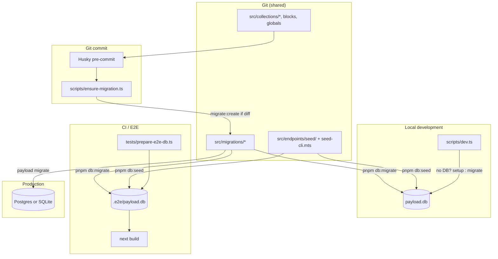

# Payload + Next.js database data flow (reusable prompt)

> **Use this doc** as a prompt when bootstrapping the same migration workflow on another Payload 3 + Next.js project. It describes how **payload-figma-boilerplate** handles schema, seed data, development, git hooks, E2E, and production — end to end.

**Stack reference (this repo):** Payload CMS 3.x · Next.js 16 · `@payloadcms/db-sqlite` · `@payloadcms/next` · pnpm · TypeScript · Playwright E2E/visual · Husky pre-commit

---

## Core idea

Separate **schema** from **data** and version both through git — never through committed database files.

| Concern | Source of truth in git | Runtime storage |
|---------|------------------------|-----------------|
| **Schema** (tables, columns, indexes) | `src/migrations/` | Applied to DB via `payload migrate` |
| **Baseline content** (admin, demo pages, media) | `src/endpoints/seed/` + `scripts/seed-cli.mts` | Inserted after migrate via seed script |
| **Personal / local experiments** | — | Local SQLite file (gitignored) |

**Rules:**

- `push: false` on the database adapter — no silent dev-push schema drift
- Migrations are the **only** way to change structure
- Seed clears and repopulates demo content — use `pnpm db:reset` for a clean slate
- Never commit `*.db`, `.e2e/`, or other local database files

---

## Architecture diagram



---

## Two moments, two jobs

Developers only need to remember **`pnpm dev`** day to day. Two automated paths keep schema in sync:

| Moment | Trigger | What runs | Purpose |
|--------|---------|-----------|---------|
| **Run the app** | `pnpm dev` | `db:setup` (first time) or `db:migrate` | **Apply** migrations from git to local DB |
| **Save to git** | `git commit` (schema files staged) | `db:ensure-migration` | **Create** migration file if Payload detects a schema diff |

Frontend-only commits (components, CSS, pages) **never** trigger the hook.

---

## Data flow by environment

### 1. First clone / new developer

```text
pnpm install          → Husky installed (prepare script)
cp .env.example .env  → PAYLOAD_SECRET, DATABASE_URL, SEED_ADMIN_*
pnpm dev
  │
  ├─ payload.db missing?
  │    └─ pnpm db:setup
  │         ├─ payload migrate     (create all tables from src/migrations/)
  │         └─ pnpm db:seed          (admin, demo home, media)
  │
  └─ next dev
```

### 2. Daily development (after pulling main)

```text
pnpm dev
  │
  ├─ payload migrate   (no-op if already up to date; applies new PR migrations)
  └─ next dev
```

### 3. Schema change (Payload collections / fields / blocks)

```text
Edit src/collections/*, src/blocks/*, src/Header|Footer/*, src/payload.config.ts
  │
git add … && git commit
  │
  └─ pre-commit: pnpm db:ensure-migration
       │
       ├─ Layer 1: schema staged but no src/migrations/ staged?
       │    No  → skip (UI-only commit)
       │    Yes + migration staged → OK
       │    Yes, no migration → Layer 2
       │
       └─ Layer 2:
            ├─ pnpm db:migrate
            ├─ pnpm payload migrate:create --name YYYYMMDD_HHMMSS_auto
            ├─ New files? → git add src/migrations/* → commit continues
            └─ No diff? → commit continues (access-only change)
```

### 4. Broken local database

```text
pnpm db:reset
  ├─ delete local DB (from DATABASE_URL)
  └─ pnpm db:setup  (migrate + seed)
pnpm dev
```

### 5. E2E / CI (Playwright)

```text
pnpm test:e2e
  │
  └─ webServer command:
       pnpm exec tsx tests/prepare-e2e-db.ts && pnpm build && pnpm start
       │
       prepare-e2e-db.ts:
         ├─ delete .e2e/payload.db
         ├─ pnpm db:migrate   (DATABASE_URL=file:./.e2e/payload.db)
         └─ pnpm db:seed      (E2E env vars)
       │
       pnpm build   (generateStaticParams → getPayload → needs migrated schema)
       pnpm start
       │
       Playwright runs tests against http://localhost:3000
```

**Important:** Production build during E2E must not hit an interactive Payload migration prompt. E2E DB must be created via **migrate + seed**, not dev push.

### 6. Production deploy

```text
payload migrate    (apply pending migrations to production DB)
pnpm build         (static generation sees current schema)
pnpm start         (or platform-specific start)

Do NOT run seed in production unless staging intentionally.
Content in prod → Payload admin UI.
```

---

## File map (this repo)

```text
src/
  payload.config.ts          # push: false, prodMigrations, sqliteAdapter
  collections/               # Payload collection configs (schema intent)
  blocks/                      # Block configs (layout builder schema)
  Header/, Footer/             # Global configs
  migrations/
    index.ts                   # exports migrations array for adapter + hook
    YYYYMMDD_HHMMSS_*.ts
    YYYYMMDD_HHMMSS_*.json
  endpoints/seed/              # Demo content seed modules

scripts/
  db-path.ts                   # Parse DATABASE_URL → file path
  dev.ts                       # setup-if-no-DB else migrate → next dev
  db-reset.ts                  # delete DB → db:setup
  ensure-migration.ts          # pre-commit Layer 1 + Layer 2
  seed-cli.mts                 # CLI entry for db:seed

tests/
  prepare-e2e-db.ts            # delete E2E DB → migrate → seed

.husky/
  pre-commit                   # pnpm db:ensure-migration

.env.example                   # PAYLOAD_SECRET, DATABASE_URL, SEED_ADMIN_*
.gitignore                     # *.db, .e2e/
```

---

## Configuration snippets

### `payload.config.ts` (database section)

```ts
import { migrations } from './migrations'

db: sqliteAdapter({
  client: { url: process.env.DATABASE_URL || 'file:./payload.db' },
  push: false,
  prodMigrations: migrations,
}),
```

### `package.json` scripts

```json
{
  "dev": "tsx --env-file=.env scripts/dev.ts",
  "db:migrate": "payload migrate",
  "db:seed": "tsx --env-file=.env scripts/seed-cli.mts",
  "db:setup": "pnpm db:migrate && pnpm db:seed",
  "db:reset": "tsx --env-file=.env scripts/db-reset.ts",
  "db:ensure-migration": "tsx --env-file=.env scripts/ensure-migration.ts",
  "ci": "pnpm db:migrate && pnpm build",
  "prepare": "husky"
}
```

### Environment variables

| Variable | Local dev | E2E / Playwright | Production |
|----------|-----------|------------------|------------|
| `DATABASE_URL` | `file:./payload.db` | `file:./.e2e/payload.db` | Postgres URL or managed SQLite |
| `PAYLOAD_SECRET` | `.env` | CI / test env | Platform secret |
| `NEXT_PUBLIC_SERVER_URL` | `http://localhost:3000` | `http://localhost:3000` | Production URL |
| `SEED_ADMIN_*` | `.env` | Fixed test values in prepare-e2e | Staging only (optional) |

---

## Pre-commit hook (ensure-migration)

**Watched paths** (staged files):

- `src/collections/**`
- `src/fields/**`
- `src/blocks/**`
- `src/Footer/**`, `src/Header/**`
- `src/plugins/**`
- `src/payload.config.ts`

**Node note:** `payload migrate:create` runs via the standard `pnpm payload` CLI on your local Node version.

---

## Related docs

- [database-collaboration-and-deployment-plan.md](./plans/database-collaboration-and-deployment-plan.md) — rollout checklist and team contract
- [database.md](./database.md) — command cheat sheet
- [README.md](../README.md) — setup + scripts table
